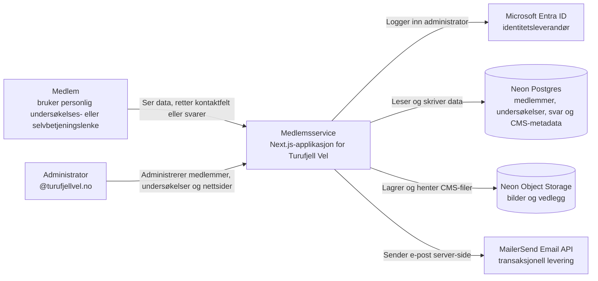
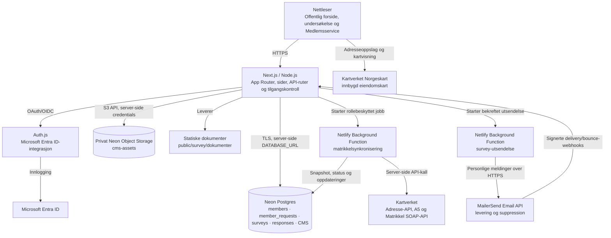
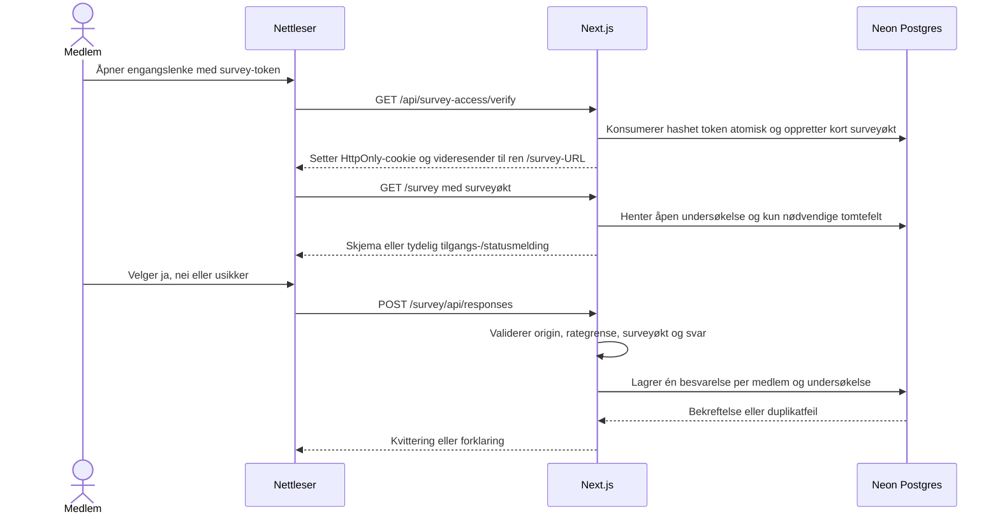
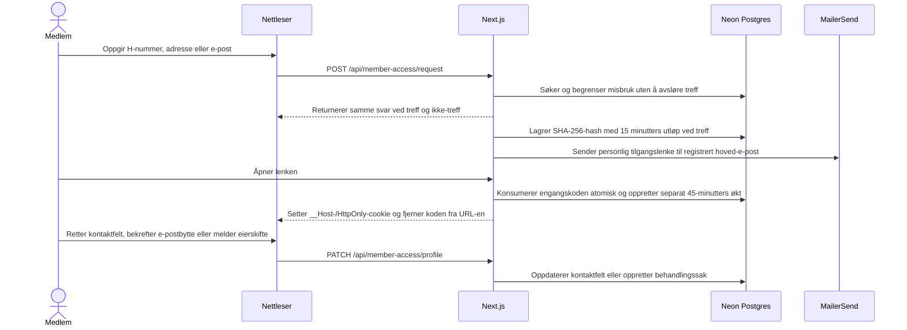
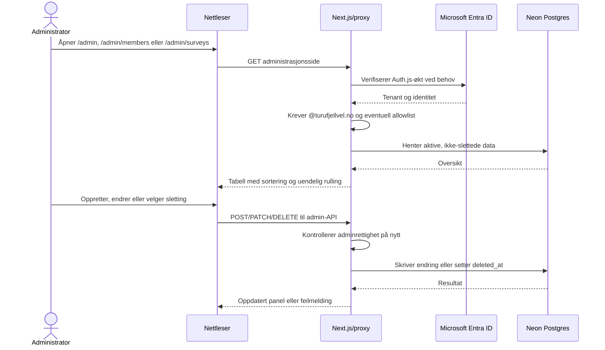
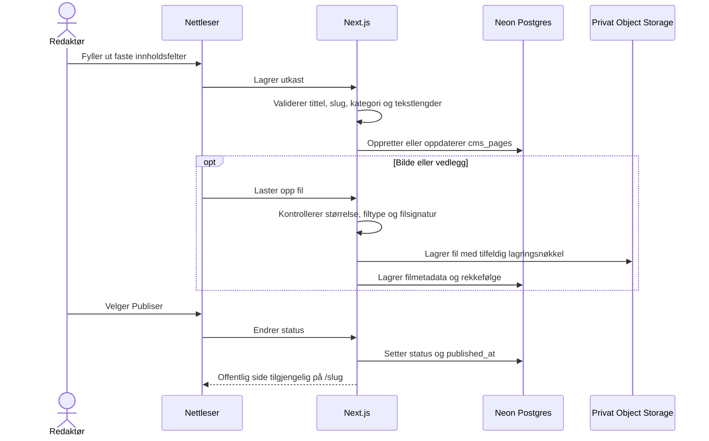

# Medlemsservice · Turufjell Vel

En modulbasert medlemsservice bygget med Next.js, React, Node, Neon Postgres og
Neon Object Storage. Den har medlemsregister, undersøkelser og et strukturert
CMS for informasjonssider.

## Krav

- Node.js 22.19 eller nyere
- npm
- En Neon-konto og database

## Lokal oppstart

```bash
npm install
cp .env.example .env.local
npm run dev
```

Åpne deretter `http://localhost:3000`.

`npm run dev`, databaseoppsett og medlemsimport bruker systemets sertifikatlager via `--use-system-ca`.
Dette gjør at Node også stoler på sertifikatutstedere installert i operativsystemet,
for eksempel i nettverk med HTTPS-inspeksjon. Ved `UNABLE_TO_GET_ISSUER_CERT_LOCALLY`,
kontroller Node-versjonen og start serveren på nytt med `npm run dev`.
Sertifikatkontrollen skal ikke deaktiveres.

## Sider og tilgang

- `/` er en offentlig forside med logo, hovedinnhold og bunnfelt.
- **Mine medlemsopplysninger** ligger alltid på forsiden før publiserte artikler.
  Et medlem kan be om en 15-minutters engangslenke med H-nummer, gateadresse eller
  registrert e-postadresse, eller sende inn en ny tomt til behandling.
- `/mine-opplysninger` viser medlemsdata etter at den personlige e-postlenken er
  åpnet. Siden er ikke indekserbar og krever en gyldig HttpOnly-økt.
- Innloggede administratorer får lenke direkte til adminportalen i bunnfeltet;
  øvrige brukere får innloggingslenken.
- Hamburgermenyen åpner Microsoft 365-innlogging via `/admin/login`.
- `/admin` er startsiden for Medlemsservice og viser tilgjengelige moduler.
- `/admin/inbox` er oppgavelisten for innmeldinger, eierskifter og
  matrikkelavklaringer, også når innsenderen ennå ikke har bekreftet e-postadressen.
- `/admin/members` er modulen Medlemsregister.
- `/admin/surveys` er modulen Undersøkelser.
- `/admin/web` er CMS-et for nettsider, hovedbilder og nedlastbare vedlegg.
- `/admin/audit` er den administratorbeskyttede oversikten Brukerendringer med
  før- og etterverdier for endringer i sentrale tabeller.
- `/<slug>` viser en publisert informasjonsside. Utkast kan bare forhåndsvises
  fra administrasjonen.
- De seks sist publiserte informasjonssidene vises automatisk på `/`.
- Undersøkelsen ligger på `/survey`; invitasjonens engangskode utveksles via
  `/api/survey-access/verify` og fjernes straks fra adresselinjen.
- Svar sendes til `/survey/api/responses`, og dokumenter ligger under `/survey/dokumenter/`.
  Skjemaet sender vist `questionVersion`; endret spørsmålsversjon avvises med
  konflikt før lagring, og medlemmet må laste inn spørsmålene på nytt.
- Andre sider og API-er krever autorisert innlogging som standard, også nye ruter.
  Innloggingsendepunkter og nødvendige statiske ressurser er offentlige.
- Query-formatet `?klm=...&xyz=...` finnes bare i syntetisk mockmodus og skal
  aldri brukes til produksjonsinvitasjoner.

## Arkitektur

Skissene følger nivåene i [C4-modellen](https://c4model.com/): først systemets
kontekst, deretter containere (kjørbare eller lagrende deler). Mermaid-diagrammene
renderes direkte i GitHub og de fleste Markdown-visere.

### Systemkontekst



### Containere



`DATABASE_URL` brukes bare på serveren. Nettleseren mottar aldri database-
eller Entra-hemmeligheter. `proxy.js` stanser ikke-offentlige ruter før de når
sider eller API-ruter, og datafunksjonene kontrollerer administratortilgang en
gang til.

### Dataansvar

| Del | Ansvar |
| --- | --- |
| `app/survey/page.js` og `lib/membership.js` | Validerer den personlige lenken og henter kun medlemmet og undersøkelsen lenken gjelder. |
| `app/survey/api/responses/route.js` | Validerer svar, lenke, origin og rategrense før svaret lagres. |
| `app/admin/*` og `app/api/admin/*` | Viser og endrer medlemmer/undersøkelser etter Microsoft-innlogging. |
| `app/api/member-access/*` og `lib/member-self-service.js` | Matcher medlem server-side, sender tidsbegrenset tilgangslenke, validerer den hash-lagrede hemmeligheten og tillater bare retting av kontaktfeltene. |
| `app/api/membership-requests/*` | Tar imot ny innmelding, verifiserer oppgitt e-post og legger forespørselen i administrativ behandlingskø. |
| `app/api/admin/member-requests/*` | Krever Entra-basert administratortilgang og godkjenner eller avviser verifiserte eierskifter og innmeldinger. |
| `app/admin/web/*` og `app/api/admin/cms/*` | Administrerer strukturert sideinnhold og filmetadata. Alle endringer krever adminøkt. |
| `app/admin/audit`, `lib/admin-audit.js` og databasetriggere | Viser et skrivebeskyttet revisjonsspor for medlemmer, henvendelser, undersøkelser, svar, nettsider og vedlegg. |
| `app/[slug]/page.js` og `components/CmsPageView.js` | Viser kun publiserte sider med systemstyrt typografi og avsnitt. |
| `app/api/cms/files/*` og `lib/cms-storage.js` | Leverer filer fra en privat bøtte etter kontroll av publiseringsstatus eller adminøkt. |
| `lib/admin-*.js` | Felles serverlogikk for sortering, opprettelse, oppdatering og myk sletting. |
| `lib/matrikkel-client.js` | Server-side klient for Adresse-API, A5-avvik og Matrikkelens SOAP-tjenester. |
| `lib/matrikkel-sync.js` | Oppretter sikkerhetskopi, behandler medlemmer og lagrer fremdrift og avvik. |
| `netlify/functions/matrikkel-sync-background.mjs` | Kjører lange synkroniseringer uten å holde nettleserforespørselen åpen. |
| `lib/mailer-service.js` og `lib/survey-email.js` | Validerer og sender e-post server-side, bygger personlig survey-invitasjon og holder MailerSend-detaljer utenfor resten av applikasjonen. |
| `lib/email-templates.js` | Rendrer også de profilerte tilgangs- og innmeldingsmailene som HTML og ren tekst. |
| `app/api/webhooks/mailersend` | Validerer HMAC-signatur og registrerer nødvendige leverings- og bounce-hendelser idempotent. |
| `netlify/functions/survey-email-background.mjs` | Behandler en databasebasert utsendelseskø kontrollert uten å holde nettleserforespørselen åpen. |
| Neon Postgres | Holder medlemsdata, spørsmålsoppsett, besvarelser, sideinnhold og filmetadata. |
| Neon Object Storage | Holder binære bilder og vedlegg i den private bøtten `cms-assets`. |

## Flytdiagrammer

### Medlemslenke og innsending av svar



### Innsyn og retting av medlemsopplysninger



### Administrasjon av medlemmer og undersøkelser



Sletting er alltid myk: medlemmer får `deleted_at` og tilbakekalt medlemslenke,
mens undersøkelser får `deleted_at` og lukkes. Vanlige oppslag filtrerer bort
slike rader; historiske svar beholdes.

### Opprettelse og publisering av nettside



Redaktøren kan bare beskrive innholdet. Datamodellen har ingen HTML, Markdown,
fontvalg, farger eller egendefinert styling. React rendrer teksten som ren tekst,
og frontend bestemmer automatisk avsnitt, typografi, avstander og responsiv layout.

## Lokal testing uten database

Aktiver mock-modus ved å sette `MOCK_DATA=true` i `.env.local`.
Start eller start utviklingsserveren på nytt med `npm run dev`.
Ingen database brukes til medlemsoppslag eller innsendinger i denne modusen.
Alle medlemsopplysningene er fiktive. Når mockmodus er av, skal lokal utvikling
alltid bruke en isolert schema-only development-gren med syntetiske data.
Produksjonsforbindelsen skal ikke ligge i lokal standardkonfigurasjon.
Den e-postbaserte medlemsselvbetjeningen og behandlingskøen kan ikke testes i
mock-modus og utfører ingen reell utsendelse der; de krever Neon og en bevisst
aktivert MailerSend-konfigurasjon.

Disse gamle query-lenkene er kun test-fixtures for mockmodus:

- [Gyldig medlem, ikke svart](http://localhost:3000/survey?klm=11111111111111111111111111111111&xyz=616fd7e9e244b6f4947eb1822dbd01ad)
- [Har allerede svart](http://localhost:3000/survey?klm=22222222222222222222222222222222&xyz=616fd7e9e244b6f4947eb1822dbd01ad)
- [Medlem med manglende valgfrie opplysninger](http://localhost:3000/survey?klm=33333333333333333333333333333333&xyz=616fd7e9e244b6f4947eb1822dbd01ad)
- [Ukjent medlem](http://localhost:3000/survey?klm=ffffffffffffffffffffffffffffffff&xyz=616fd7e9e244b6f4947eb1822dbd01ad)
- [Feil ID-format](http://localhost:3000/survey?klm=feil&xyz=616fd7e9e244b6f4947eb1822dbd01ad)
- [Manglende ID](http://localhost:3000/survey)
- [Ugyldig undersøkelse](http://localhost:3000/survey?klm=11111111111111111111111111111111&xyz=ukjent)
- [Simulert databasefeil](http://localhost:3000/survey?klm=dddddddddddddddddddddddddddddddd&xyz=616fd7e9e244b6f4947eb1822dbd01ad)

Testsvar lagres som lokale JSON-filer i `.mock-data/` (ignorert av Git),
og beholdes ved omstart. Etter innsending viser samme lenke at tomten har svart.
Slett `.mock-data/` for å nullstille innsendte testsvar. Medlem 2 vil alltid
være forhåndsregistrert som besvart. Mock-feltene er konfigurert i
`data/mock-members.js`. Sett `MOCK_DATA=false` og start serveren på nytt når
Neon-databasen er klar. Det skjer ingen automatisk overgang til mock ved databasefeil.

## Neon CLI og prosjektoppsett

Neon CLI og prosjektets Neon-verktøy kan brukes lokalt. CLI-innlogging og
eventuell MCP-innlogging fullføres separat i nettleseren. Konkrete prosjekt-,
gren- og endpoint-ID-er skal ligge i intern driftsdokumentasjon, ikke her.

Konfigurasjonen ligger i `neon.mjs` (JavaScript), med:

```js
import { defineConfig } from "@neon/config/v1";

export default defineConfig({
  preview: {
    buckets: {
      "cms-assets": {},
    },
  },
});
```

Ved oppsett på en ny maskin skal standardkoblingen peke på en isolert
schema-only development-gren med syntetiske data, aldri produksjon:

```bash
neon login
neon link --project-id <project-id> --branch <development-branch> -y
neon config plan
neon deploy
```

Neon henter tilkoblings- og lagringsvariabler til en lokal miljøfil ved
tilkobling/deploy.
Sørg for at appens `DATABASE_URL` i `.env.local` er den nye verdien; `.env.local`
har prioritet dersom Neon skriver til `.env`. Ikke sjekk inn disse filene.
`neon deploy` anvender Neon-konfigurasjonen. Det publiserer ikke Next.js-appen
og kjører ikke `database/schema.sql`; databaseoppsettet nedenfor er et eget steg.

`cms-assets` er privat. Neon oppretter/henter lokalt `AWS_ACCESS_KEY_ID`,
`AWS_SECRET_ACCESS_KEY`, `AWS_ENDPOINT_URL_S3` og `AWS_REGION`. Netlify reserverer
flere `AWS_*`-navn til sin egen Functions-runtime. Legg derfor de samme verdiene
inn i Netlify som `NEON_STORAGE_ACCESS_KEY_ID`, `NEON_STORAGE_SECRET_ACCESS_KEY`,
`NEON_STORAGE_ENDPOINT` og `NEON_STORAGE_REGION`. Ingen av dem skal ha
`NEXT_PUBLIC_`-prefiks. Se
[Netlifys begrensninger for Functions-variabler](https://docs.netlify.com/build/functions/environment-variables/#overrides-and-limitations).
Test helst `neon deploy` på en egen Neon-gren før samme konfigurasjon anvendes på
produksjonsgrenen.

## Database

1. Opprett et prosjekt i Neon.
2. Åpne SQL Editor.
3. Legg både en pooled `DATABASE_URL` og direkte `DATABASE_URL_UNPOOLED` i `.env.local`.
4. Trykk `Connect` i Neon og kopier connection string.
5. Legg den i `.env.local`:

```env
DATABASE_URL=postgresql://...-pooler...
DATABASE_URL_UNPOOLED=postgresql://...
```

6. Sett `APP_ENVIRONMENT=development` og kjør `npm run db:setup`. Skriptet
   krever den direkte URL-en og avviser miljømismatch, slik at migrering aldri
   går via PgBouncer eller utilsiktet mot et annet miljø.

## Strukturert CMS

CMS-et ligger på `/admin/web`. Oversikten har tittelsøk og viser tittel,
kategori, status, endringsdato, publiseringsdato og handlinger. Redigering skjer
i et panel fra høyre. En side består av:

- obligatorisk tittel og automatisk foreslått URL-slug
- kategori, valgfri ingress og valgfri hovedtekst
- valgfritt hovedbilde med alt-tekst og bildetekst
- inntil 20 vedlegg med visningsnavn og redigerbar rekkefølge
- status `Utkast` eller `Publisert`, samt opprettet-, endret- og publisertdato

Tekst lagres uten HTML eller Markdown. Tomme linjer og linjeskift gjøres til
avsnitt i den offentlige visningen. Hovedbilder støtter JPG, PNG og WebP opp til
10 MB. Vedlegg støtter PDF, DOC/DOCX, XLS/XLSX, PPT/PPTX, ZIP, JPG, PNG, WebP og
GIF opp til 20 MB per fil. Filinnhold kontrolleres mot filendelsen før opplasting.

Publiserte sider vises på `/<slug>` og på forsiden. Forhåndsvisning av utkast
krever adminøkt. Sider og filmetadata mykslettes med `deleted_at`; vanlige
spørringer henter dem aldri. Binærfilen beholdes i lagringsbøtten når redaktøren
sletter den, slik at slettingen er reverserbar på datanivå.

## Dokumenter

Legg PDF-er eller andre filer i:

```text
public/survey/dokumenter/
```

Registrer dem deretter i `data/survey.js` i arrayet `surveyDocuments`.

Eksempel:

```js
export const surveyDocuments = [
  {
    title: "Informasjon om Kristnatten",
    description: "Relevant bakgrunnsdokument før du svarer.",
    href: "/survey/dokumenter/kristnatten.pdf",
    meta: "PDF",
  },
];
```

## GitHub

Prosjektet bruker `main` som produksjonsgren. Pushes til `main` og alle pull requests
kontrolleres av GitHub Actions-konfigurasjonen i `.github/workflows/ci.yml`:

```bash
npm ci
npm run check
```

`npm run check` kjører ESLint, alle Node-testene og et komplett Next.js-
produksjonsbygg. Bygget bruker Next.js' støttede `--webpack`-flagg for stabil
kjøring i CI- og Functions-miljøer; lokal utvikling bruker fortsatt standardbyggeren.
Lokale miljøfiler, Neon-koblingen og Netlifys lokale
cachemappe er utelatt fra Git gjennom `.gitignore`.

GitHub Actions er ikke et krav for å bruke Netlify. Vi beholder Actions fordi
arbeidsflyten gir en separat kvalitetskontroll på pull requests uten tilgang
til produksjonshemmeligheter. Netlify bygger og publiserer applikasjonen med
`npm run build`; den kommandoen kjører ikke lint eller tester. Push til en
arbeidsgren uten pull request kjører ikke CI. Dette unngår doble CI-kjøringer
for samme endring på arbeidsgrenen og pull requesten.

Konfigurer `quality` fra arbeidsflyten **Code quality** som en påkrevd statuskontroll
for `main`, og krev pull request før innfletting. Dette er en separat
GitHub-innstilling; workflow-filen aktiverer ikke grenbeskyttelse. Netlify venter
ikke automatisk på Actions når noen pusher direkte til `main`. Hvis direkte
push fortsatt skal tillates, må en egen kvalitetsport avtales, for eksempel
`npm run check` som Netlify-byggkommando. Se
[Netlifys byggkonfigurasjon](https://docs.netlify.com/build/configure-builds/overview/)
og [GitHubs påkrevde statuskontroller](https://docs.github.com/en/repositories/configuring-branches-and-merges-in-your-repository/managing-protected-branches/about-protected-branches#require-status-checks-before-merging).

### Automatiserte tester og brukerlogg

Kjør `npm test` for modul- og rutetester, eller `npm run check` for lint, tester
og produksjonsbygg. Rutetestene bruker ekte Next.js Request/Response-objekter
og kjører rutekoden med eksplisitt erstattede avhengigheter. Testkommandoens
`--experimental-vm-modules` brukes bare til denne isolasjonen; det er ikke
et runtime-flagg for Netlify. Ingen nye testavhengigheter er installert.

[Kvalitetsgjennomgangen](docs/quality-review.md) beskriver rutedekning,
begrensninger, anbefalte neste tester og vurderingen av hvilke hendelser som
bør registreres. Testene kobler ikke til Neon, Microsoft, MailerSend eller
Kartverket. Reelle transaksjoner og nettleserflyter trenger egne tester med
syntetiske data i et isolert miljø.

`/admin/audit` har søk i aktør, post-ID og før-/etterverdier, samt filtre for
bruker, område, endringstype, status og datointervall. Datoene er hele kalenderdager
i `Europe/Oslo`, inkludert valgt sluttdato. Filtrering og sideinndeling skjer på
serveren med 50 poster per side. Store fritekstsøk trenger fortsatt måling og
eventuell indeksering; se kvalitetsgjennomgangen.

Generering av medlems- og resultatseksporter logges i eksisterende `audit_log`
under området **Administrativ handling** (`table_name = admin_actions`). Hendelsen
inneholder administrator, tidspunkt, eksporttype, antall poster, utvalg og
undersøkelses-ID. Ingen medlemsliste, rå e-postadresser, token eller filinnhold
legges til i hendelsen. Den bekrefter at filen er generert, ikke at nettleseren
har mottatt den. Kan hendelsen ikke lagres, returneres ikke eksportfilen.
Mock-eksport av undersøkelsesresultater oppretter ingen databasehendelse.
Dette bruker dagens skjema og krever ingen ny migrering eller miljøvariabel.

## Produksjonssetting: Netlify + Neon + Microsoft Entra ID

Kartmodulen ligger på `/admin/map`, med beskyttede Node-ruter
`POST /api/admin/map/search` og `POST /api/admin/map/export`. De bruker eksisterende
`members`-rettighet og pooled databaseforbindelse; ingen nye miljøvariabler,
Entra-roller, bakgrunnsfunksjoner eller skjemamigreringer trengs.
Node må kunne nå `ws.geonorge.no` og `overpass-api.de` over HTTPS, og nettleseren
må kunne hente kartbilder fra `cache.kartverket.no`. CSP er utvidet kun for
denne bildekilden. Sørg for passende delt/WAF-rate-limit på de to rutene ved
produksjonsbruk; den lokale 20/minutt-grensen er bare per-instans.
Se [kartmodulens datakilder, begrensninger og bruk](docs/map-explorer.md).

`netlify.toml` inneholder byggkommando, publiseringsmappe, Node-versjon og
funksjonsmappe. Netlify håndterer Next.js App Router gjennom sin Next.js-adapter,
mens den lange matrikkelsynkroniseringen kjøres som en Netlify Background
Function. Survey-utsendelser kjøres på samme måte i en egen bakgrunnsfunksjon.
Se også [Netlifys Next.js-veiledning](https://docs.netlify.com/build/frameworks/framework-setup-guides/nextjs/overview/)
og [veiledningen for Background Functions](https://docs.netlify.com/build/functions/background-functions/).

Følg punktene i denne rekkefølgen ved første produksjonssetting. Bruk en konto
med tilgang til GitHub-repositoriet, Netlify-teamet, Neon-prosjektet og
appregistreringen i Microsoft Entra ID.

### 1. Kontroller kode og GitHub

1. Kontroller at siste commit ligger på `main` i `ibjohansen/tfv-poll`.
2. Åpne fanen **Actions** i GitHub og kontroller at arbeidsflyten
   **Code quality** er grønn for committen som skal publiseres.
   Kontroller at `quality` er påkrevd før innfletting til `main` og at direkte
   pushes ikke omgår kontrollen. En grønn Netlify-deploy alene bekrefter bare bygget.
3. Kjør den samme kontrollen lokalt dersom det er gjort endringer etter siste
   push:

```bash
npm ci
npm run check
git status --short
```

`git status --short` skal ikke vise ukjente endringer før produksjonssetting.

### 2. Kontroller Neon og databaseskjemaet

1. Kontroller at Neon CLI peker på prosjektets produksjonsgren:

```bash
neon status
neon config plan
```

2. Dersom planen viser at den private bøtten `cms-assets` mangler, kjør:

```bash
neon deploy
```

3. Kontroller at `.env.local` inneholder både pooled `DATABASE_URL` og direkte
   `DATABASE_URL_UNPOOLED` for den samme produksjonsgrenen. Ikke skriv ut eller
   lim forbindelsesstrengene inn i logger eller dokumentasjon.
4. Kjør databaseskjemaet med den direkte forbindelsen når `database/schema.sql`
   er endret:

```bash
APP_ENVIRONMENT=production npm run db:setup
```

Kommandoen er idempotent. Den kjørende Netlify-applikasjonen skal bruke pooled
`DATABASE_URL`; migrering og import skal bruke den direkte forbindelsen. Dette
følger [Neons anbefaling for pooling og migrering](https://neon.com/docs/connect/connection-pooling).

Skjemaet oppretter også `audit_log` og triggere på `members`, `member_requests`,
`surveys`, `survey_responses`, `cms_pages` og `cms_attachments`. Loggen starter
når migreringen kjøres; den rekonstruerer ikke historikk fra tidligere
endringer. Tilgangstoken, verifiseringshash og interne lagringsnøkler utelates.

Sikkerhetsmigreringen er todelt. `db:setup` er additiv og kan kjøres før ny
kode deployes. Etter at ny surveyflyt er publisert og gamle lenker er erstattet,
fjernes klartekstkolonnene med:

```bash
APP_ENVIRONMENT=production SECURITY_CLEANUP_CONFIRMED=true npm run db:security-cleanup
```

Oppryddingen må ikke kjøres mens en eldre applikasjonsversjon fortsatt leser
`members.access_token`. Opprett restore-punkt og test begge steg på en
schema-only gren først.

### 3. Opprett og koble Netlify-prosjektet

1. Logg inn på Netlify og velg **Add new project → Import an existing project**.
2. Velg **GitHub**, godkjenn nødvendig repository-tilgang og velg
   `ibjohansen/tfv-poll`.
3. Bruk `main` som produksjonsgren.
4. Kontroller innstillingene som leses fra `netlify.toml`:

| Innstilling | Verdi |
| --- | --- |
| Base directory | tom / repositoryroten |
| Build command | `npm run build` |
| Publish directory | `.next` |
| Functions directory | `netlify/functions` |
| Node.js | `22` |

5. Opprett prosjektet. Netlify tildeler nå en adresse som
   `https://<prosjektnavn>.netlify.app`.
6. Hvis et eget domene skal brukes med en gang, legg det til under
   **Domain management → Production domains** før autentisering konfigureres.
7. Bruk `https://medlemsservice.turufjellvel.no` som kanonisk
   produksjonsadresse, uten avsluttende `/`, i både `AUTH_URL` og Entra-oppsettet.

Netlify beskriver den samme Git-flyten i
[Import an existing project](https://docs.netlify.com/manage/projects/add-new-project/#bring-existing-code-to-netlify).

### 4. Legg inn miljøvariabler i Netlify

Åpne **Project configuration → Environment variables** og legg inn variablene
enkeltvis. Velg produksjonskonteksten og scopes som gjør dem tilgjengelige for
både build og Functions.

Merk bare faktiske credentials og hemmeligheter som **Contains secret values**.
`AUTH_URL`, `API_MATRIKKEL_BASE_URL`, `MATRIKKEL_SYNC_EMAILS` og
`NEON_STORAGE_REGION` er offentlig konfigurasjon og skal ikke merkes som
hemmelige. Verdiene finnes med hensikt i dokumentasjon og tester.

Ikke bruk `netlify env:import .env.local`. Den lokale filen inneholder verdier
som ikke skal inn i produksjonsmiljøet, blant annet direkte databaseforbindelse,
lokal `AUTH_URL` og eventuell mock-konfigurasjon. Netlify leser heller ikke den
lokale `.env`-filen automatisk under skybygget; se
[Netlify environment variables](https://docs.netlify.com/build/configure-builds/environment-variables/).

#### Påkrevd for database og CMS

| Variabel | Produksjonsverdi |
| --- | --- |
| `DATABASE_URL` | Pooled Neon-forbindelse for produksjonsgrenen |
| `APP_ENVIRONMENT` | `production` |
| `TOKEN_AUDIENCE` | Unik, ikke-hemmelig verdi for produksjonsappen, for eksempel `tfv-production` |
| `SECURITY_EVENT_HMAC_KEY` | Unik tilfeldig produksjonshemmelighet på minst 32 bytes |
| `NEON_STORAGE_ACCESS_KEY_ID` | Verdien fra lokal `AWS_ACCESS_KEY_ID` |
| `NEON_STORAGE_SECRET_ACCESS_KEY` | Verdien fra lokal `AWS_SECRET_ACCESS_KEY` |
| `NEON_STORAGE_ENDPOINT` | Verdien fra lokal `AWS_ENDPOINT_URL_S3` |
| `NEON_STORAGE_REGION` | Verdien fra lokal `AWS_REGION`, for eksempel `eu-central-1` |

Ikke opprett `AWS_ACCESS_KEY_ID`, `AWS_SECRET_ACCESS_KEY` eller `AWS_REGION` i
Netlify. Navnene er reservert av plattformen. Variabelen
`AWS_SECRET_ACCESS_KEY_ID` finnes heller ikke; Neons opprinnelige navn er
`AWS_SECRET_ACCESS_KEY`. Applikasjonen foretrekker `NEON_STORAGE_*` og bruker
Neons opprinnelige `AWS_*`-variabler som fallback ved lokal utvikling.

#### Påkrevd for Microsoft-innlogging

| Variabel | Produksjonsverdi |
| --- | --- |
| `AUTH_SECRET` | Unik produksjonshemmelighet på minst 32 bytes |
| `AUTH_MICROSOFT_ENTRA_ID_TENANT_ID` | Directory tenant ID |
| `AUTH_MICROSOFT_ENTRA_ID_ID` | Application client ID |
| `AUTH_MICROSOFT_ENTRA_ID_SECRET` | Verdien til client secret, ikke secret-ID-en |
| `AUTH_URL` | `https://medlemsservice.turufjellvel.no` |
| `ADMIN_EMAILS` | Obligatorisk, kontrollert liste over godkjente administratorer |
| `ADMIN_REQUIRED_ROLES` | Anbefalt: kommaseparerte Entra app-roller som skal godtas |

Lag en ny `AUTH_SECRET` for produksjon, for eksempel lokalt med:

```bash
openssl rand -base64 32
```

#### Påkrevd for matrikkelsynkronisering

| Variabel | Produksjonsverdi |
| --- | --- |
| `API_MATRIKKEL_BASE_URL` | `https://matrikkel.no/matrikkelapi/wsapi/v1` |
| `API_MATRIKKEL_USR` | Matrikkel-brukernavn |
| `API_MATRIKKEL_PWD` | Matrikkel-passord, skrevet normalt uten `\$`-escaping |
| `MATRIKKEL_SYNC_EMAILS` | Kommaseparert rolle-allowlist for godkjente driftskontoer |
| `MATRIKKEL_JOB_SECRET` | En annen unik hemmelighet på minst 32 bytes |

Generer `MATRIKKEL_JOB_SECRET` separat; ikke bruk samme verdi som `AUTH_SECRET`.
Den samme verdien må være tilgjengelig for både Next.js-ruten og
`matrikkel-sync-background` i produksjonens Functions-scope. Ingen ny
miljøvariabel eller databasemigrering trengs for oppstartsrettelsen.

#### Påkrevd for MailerSend

| Variabel | Produksjonsverdi |
| --- | --- |
| `MAILERSEND_ENABLED` | `true` først etter at senderdomenet er verifisert; behold `false` under bootstrap |
| `MAILERSEND_BULK_ENABLED` | `false` inntil masseutsendelse er eksplisitt godkjent; testmail virker fortsatt |
| `MAILERSEND_API_TOKEN` | Begrenset API-token fra MailerSend, aldri et browser-token |
| `MAILERSEND_FROM_EMAIL` | En eksisterende avsender på `turufjellvel.no`, for eksempel `post@turufjellvel.no` |
| `MAILERSEND_FROM_NAME` | `Turufjell Vel` |
| `MAILERSEND_REPLY_TO_EMAIL` | En overvåket adresse som kan motta svar |
| `MAILERSEND_DOMAIN_ID` | Domain ID for det verifiserte `turufjellvel.no`-domenet |
| `MAILERSEND_WEBHOOK_SIGNING_SECRET` | Individuell Signing Secret fra den opprettede webhooken |
| `MAILERSEND_JOB_SECRET` | Egen tilfeldig intern hemmelighet på minst 32 bytes |

Legg variablene inn enkeltvis og bare i produksjonskonteksten. Generer
`MAILERSEND_JOB_SECRET` separat fra alle andre hemmeligheter. Ingen av disse
verdiene skal inn i `netlify.toml`, GitHub eller ha `NEXT_PUBLIC_`-prefiks.
API-tokenet må minst ha tillatelsene `email_full` og `suppressions_read`, og bør
begrenses til sending domain der MailerSend-kontoen tilbyr dette.

#### Valgfritt eller skal utelates

- `ADMIN_EMAILS` skal aldri utelates eller være tom. Manglende eller ugyldig
  allowlist stenger all administratortilgang.
- Utelat `DATABASE_URL_UNPOOLED`; den trengs ikke av applikasjonen i drift.
- Utelat `MOCK_DATA`, `MOCK_DATA_DIR` og `MATRIKKEL_ALLOW_PRODTEST`.
- Ikke opprett `URL`; Netlify setter denne systemvariabelen selv.
- Ingen hemmelig variabel skal ha `NEXT_PUBLIC_`-prefiks.

Netlifys secretskanning er fortsatt aktiv. `netlify.toml` unntar bare de fire
offentlige konfigurasjonsnøklene over fra eksakt verdisøk. Dette hindrer falske
positiver uten å slå av skanning av `DATABASE_URL`, passord, tilgangsnøkler,
`AUTH_SECRET`, Entra client secret, MailerSend-hemmeligheter eller interne
jobbhemmeligheter. Se
[Netlify Secrets Controller](https://docs.netlify.com/build/environment-variables/secrets-controller/#configure-secret-scanning).

### 5. Registrer callback-URL i Microsoft Entra ID

1. Åpne [Microsoft Entra admin center](https://entra.microsoft.com/).
2. Kontroller øverst til høyre at riktig tenant, **TURUFJELL VEL**, er valgt.
3. Velg **Entra ID → App registrations** i venstremenyen. Bruk søkefeltet
   øverst og søk etter `App registrations` dersom menyvalget ikke vises.
4. Velg **All applications**, og åpne appregistreringen som har samme
   **Application (client) ID** som
   `AUTH_MICROSOFT_ENTRA_ID_ID`.
5. Kontroller at **Supported account types** er satt til kontoer kun i Turufjell
   vels egen organisasjon (single tenant).
6. Gå til **Authentication → Platform configurations**.
7. Velg **Add a platform → Web**, eller legg URI-en til under eksisterende
   Web-plattform.
8. Registrer nøyaktig denne adressen:

```text
https://medlemsservice.turufjellvel.no/api/auth/callback/microsoft-entra-id
```

9. Velg **Configure/Save**. Ikke legg callbacken under plattformtypen SPA, og
   ikke aktiver implicit grant.
10. Kontroller under **Certificates & secrets** at client secret ikke er utløpt,
   og at verdien i Netlify er den faktiske secret-verdien.

Microsoft krever HTTPS for ordinære produksjons-callbacker og at redirect URI
er registrert for riktig plattform. Se
[Microsofts redirect URI-veiledning](https://learn.microsoft.com/en-us/entra/identity-platform/reply-url).

Hvis produksjonsdomenet endres senere, må både `AUTH_URL` i Netlify og redirect
URI i Entra oppdateres. Utløs en ny deploy etter endringen.

### 6. Utløs produksjonsdeploy

1. Gå til **Deploys** i Netlify.
2. Velg **Trigger deploy → Deploy site**. Bruk **Clear cache and deploy site**
   hvis forrige bygg ble kjørt før miljøvariablene ble lagt inn.
3. Kontroller at byggeloggen avsluttes uten feil.
4. Kontroller at Next.js-funksjonene og
   `matrikkel-sync-background` og `survey-email-background` finnes i Netlifys
   funksjonsoversikt. Kontroller også at edge-funksjonen
   `public-member-rate-limit` er oppdaget og aktivert i deployloggen.
5. Kontroller at den publiserte deployen bruker committen som var godkjent i
   GitHub Actions.

Etter at GitHub-repositoriet er koblet til Netlify, utløser senere pushes til
`main` normalt en ny produksjonsdeploy.

### 7. Verifiser produksjonen

Utfør kontrollene i denne rekkefølgen:

- Åpne `/` og kontroller toppbilde, publiserte artikler og artikkelpanelet.
- Kontroller at **Mine medlemsopplysninger** alltid vises før artiklene. Be om
  lenke med en kontrollert testbruker via H-nummer, adresse og e-post. Bekreft
  at treff og ikke-treff gir identisk HTTP-status, responsstruktur og tekst,
  uten H-nummer, adresse, maskert e-post eller annen medlemsinformasjon.
- Åpne tilgangslenken og kontroller at URL-en straks renses, at tilgangen utløper
  etter 45 minutters inaktivitet, at H-nummer/adresse/hjemmelshaver er
  skrivebeskyttet, og at hoved-e-post bare kan endres etter bekreftelse via
  både gammel og ny adresse.
- Kontroller at forsidebildet viser et bredere utsnitt med fokus forskjøvet mot
  venstre, og at loginbildet viser et vesentlig bredere utsnitt uten å miste
  fokuspunktet.
- Åpne `/admin` i et privat vindu og kontroller at du sendes til innlogging.
- Åpne `/admin/map` med medlemsadministrator. Tegn, rediger og slett et lite
  polygon ved Turufjell; kontroller areal, bakgrunnskart, adressepunkter, veier,
  lagvalg, tabellsøk og zoom fra tabellrad, også på mobil og med tastatur.
  Kontroller at redigering/sletting fjerner gamle resultater, også under lasting.
- Kontroller at begge `/api/admin/map/*`-rutene svarer 401 uten sesjon og 403
  med rolle uten `members`-rettighet. Test feil fra ekstern karttjeneste og
  retry i isolert miljø. Kontroller at ufullstendige adressedata ikke gir en
  sammenligningsrapport med falske «mangler»-tall.
- Kontroller registersammenligningen med kjent testgrunnlag, inkludert ulike
  gnr/bnr på samme adresse, seksjonsnummer og flere kandidater. «Uten treff i
  kartutsnittet» kan bety utenfor polygonet, ikke at Kartverket mangler adressen.
  Sammenligningen skal aldri endre registeret. Fullstendige eiendomsgrenser og
  eiendommer uten adresse er ikke implementert.
- Med godkjent testgrunnlag: kontroller adresse-CSV, sammenlignings-CSV og GeoJSON
  samt kopiering. Bare sammenlignings-CSV skal ha interne kontaktopplysninger;
  GeoJSON skal ikke ha medlemmer, e-post, telefon eller tilgangslenker.
  Kart-/registereksport skal vises i brukerloggen med aktør, format og antall,
  uten eksportinnhold. Oppbevar eventuell kontaktfil sikkert og slett etter test.
- Logg inn med en godkjent administratorkonto og kontroller modulene Medlemsregister,
  Oppgaveliste, Undersøkelser, Web og Brukerendringer. Velg et medlem med gateadresse, og kontroller
  at eiendomskartet er lukket under adressefeltet i detaljpanelet og kan åpnes.
  Kontroller at lukkeknappen forblir synlig når panelet rulles. Kontroller at
  H-nummer, adresse og de øvrige eiendomsfeltene ikke kan redigeres etter
  opprettelse. Aktiver filteret for mangelfull hovedkontakt eller hoved-e-post
  og kontroller at bare relevante medlemmer vises. Aktiver deretter filteret
  for registrert kommentar og kontroller at alle og bare kommenterte medlemmer
  vises, også i kombinasjon med søk.
- Gjør en kontrollert endring på et testmedlem. Åpne `/admin/audit`, kontroller
  riktig innlogget bruker, tidspunkt og før-/etterverdi, og bruk lenken tilbake
  til medlemsposten. Kontroller søk, filtrering på bruker, område, type og status,
  datointervall (begge datoer inkludert) og at side 2 vises når det er flere enn
  50 treff. Bekreft at
  tilgangstoken, verifiseringshash og lagringsnøkler ikke finnes i loggen.
- Send ett kontrollert eierskifte og én ny innmelding med testdata. Oppgi
  gårds-/bruksnummer og eventuelt seksjonsnummer. Kontroller at innmeldingen
  vises som ubekreftet i `/admin/inbox` før e-postlenken åpnes, og som bekreftet
  etterpå. Kontroller matrikkelopplysningene fra oppgavelisten. Bruk også en
  seksjonert testeiendom og kontroller at manglende eller ugyldig seksjonsnummer
  krever kontroll eller eksplisitt manuell bekreftelse før saken kan godkjennes.
  Fjern testdataene etterpå.
- Åpne en undersøkelse, kontroller kakediagrammene under **Resultater**, og last
  ned en Excel-eksport. Eksporter også et utvalg av testmedlemmer. Kontroller at
  begge eksporter vises i brukerloggen med riktig administrator og antall poster,
  uten eksportinnhold eller personlige lenker i logghendelsen.
- I isolert testmiljø: åpne survey, endre spørsmålstekst i admin og send fra det
  gamle skjemaet. Kontroller 409 uten lagret svar, ny lasting med tomme svar og
  riktig versjon/tekst i snapshot etter ny innsending. Gamle åpne skjemaer uten
  `questionVersion` må lastes på nytt etter deploy.
- Velg **Utsendelse**, send først en testmail til en eksplisitt testadresse, og
  kontroller MailerSend-statusen. Start ikke masseutsendelsen før domenekontrollen
  nedenfor er fullført.
- Opprett et CMS-utkast, last opp et lite testvedlegg, forhåndsvis, publiser og
  kontroller den offentlige visningen. Kontroller også at sideoversikten kan
  brukes uten horisontal rulling på mobil. Fjern testinnholdet etterpå.
- Generer eller bruk testlenken for eget medlem med H-nummer 25. Kontroller
  opplysningene uten å sende inn et svar dersom undersøkelsen er reell. Kontroller
  at eiendomskartet søker på gateadressen i Flå, starter med adresseinformasjonen
  minimert, og at **Åpne i Norgeskart** åpner kartet på Norgeskarts nettside.
- Kjør bare **Test H-nummer 25** i matrikkelmodulen. Kontroller logg og resultat
  før en full matrikkelkjøring startes. Test samtidig stopp og bakgrunnsarbeid
  i isolert testmiljø først; en stoppet kjøring skal beholde statusen etterpå.
- For matrikkeljobben: kontroller at funksjonskallet går direkte til
  `/.netlify/functions/matrikkel-sync-background`, uten `Location: /admin/login`.
  Bare denne eksakte funksjonsruten skal omgå Next-innlogging; `/admin` og
  `/api/admin/matrikkel/*` skal fortsatt kreve innlogging og riktig rolle.
  Jobbhemmeligheten kontrolleres inne i funksjonen før databasebehandling.
- Kontroller at et godkjent oppstartskall mottar `202`, og deretter at
  `started_at` og behandlede poster faktisk oppdateres. I Netlify-funksjonsloggen
  skal `Matrikkel background processing started` og en avslutning/feil vises.
  `202` er bare kvittering for mottatt oppdrag, ikke en fullført tilgangskontroll
  eller bekreftelse på startet behandling.
- I isolert miljø: simuler `200` med innloggings-HTML, `307`, timeout og manglende
  jobbhemmelighet. API-et skal svare `503` med tydelig melding, og en fortsatt
  ventende kjøring skal få `failed` uten endrede medlemmer eller slettet snapshot.
  En allerede startet/stoppet kjøring skal ikke overskrives. Feilen skal vises
  også etter ny sidevisning; nettleseren skal ikke starte reservebehandling.
- Kontroller at `/api/admin/surveys` returnerer `401` uten innlogget sesjon.
- Kontroller at `/api/admin/member-requests/<id>` returnerer `401` uten
  innlogget sesjon, og at `/mine-opplysninger` ikke viser data uten gyldig cookie.
- Kontroller Netlify Functions-loggene for feil og verifiser at ingen
  hemmeligheter skrives til logg.

### 8. Tilbakerulling og etterarbeid

- Ved feil i applikasjonen: åpne **Deploys** i Netlify og publiser siste kjente
  fungerende deploy på nytt.
- Ikke reverser databaseskjemaet automatisk. Endringene er additive; undersøk
  dataene og bruk Neon restore/branch ved behov før en korrigerende migrering.
- Behold tidligere Entra redirect URI til den nye innloggingen er verifisert.
- Registrer eier og utløpsdato for Entra client secret, Matrikkel-legitimasjonen
  og interne hemmeligheter, slik at de kan roteres før utløp.
- Oppbevar medlems- og resultat-eksporter sikkert og slett lokale kopier når de
  ikke lenger er nødvendige.

Hemmeligheter skal bare administreres i Neon, Netlify og Microsoft Entra ID,
aldri i GitHub-filer eller dokumentasjon.

## Se svar i Neon

I Neon SQL Editor kan du for eksempel kjøre:

```sql
SELECT *
FROM survey_responses
ORDER BY created_at DESC;
```

En enkel opptelling:

```sql
SELECT answers->>'q1' AS svar, COUNT(*) AS antall
FROM survey_responses
WHERE survey_id = '616fd7e9e244b6f4947eb1822dbd01ad'
GROUP BY answers->>'q1'
ORDER BY antall DESC;
```

## Medlemsregister og personlige lenker

Kjør hele `database/schema.sql` i Neon SQL Editor før den nye versjonen tas i bruk.
Skriptet kan kjøres på en eksisterende database: gamle anonyme svar beholdes med
`NULL` i `member_id` og `survey_id`. Disse teller ikke som medlemsbesvarelser.

Tabellen `members` har et internt løpenummer (`id`), men ingen global
surveyhemmelighet. Hver invitasjon oppretter i stedet en tilfeldig 256-bits
engangskode for nøyaktig ett medlem og én undersøkelse. Bare SHA-256-hashen
lagres i `survey_access_tokens`; koden er miljø- og audience-bundet og utveksles
umiddelbart mot en separat, kortlivet surveyøkt.

Etter overgang fra den gamle tokenmodellen kan en fullført kampanje arkiveres
fra e-postpanelet med **Send nye sikre lenker**. Handlingen krever eksplisitt
bekreftelse og oppretter en ny kampanje; tidligere leveringshistorikk beholdes.
Kjør først deretter `db:security-cleanup` for å gjøre gamle globale lenker
permanent ugyldige på databasenivå.

Startundersøkelsen i `data/survey.js` seedes til `surveys` ved databaseoppsett.
Nye undersøkelser opprettes og redigeres i administrasjonen. Hver får en
obligatorisk sluttdato og er tilgjengelig ut denne datoen i norsk tid, samt en
tilfeldig 32-tegns hex-ID. Etter sluttdatoen viser medlemslenken at undersøkelsen
er avsluttet og API-et avviser nye svar. Svar lagres som et JSON-objekt med spørsmåls-ID-er
og `surveyVersion`; versjonen økes automatisk når spørsmålene endres. Hver
besvarelse beholder også et snapshot av spørsmålstekstene som var aktive ved
innsending. Eldre svar får beste tilgjengelige snapshot ved migreringen, siden
tidligere spørsmålstekster ikke kan rekonstrueres. Tillatte svar er `ja`, `nei`
og `usikker`.

Klikk på en undersøkelse i `/admin/surveys` og velg fanen **Resultater** for å
se svarfordeling per spørsmål som kakediagram, antall og prosent. Dersom
spørsmålene har blitt endret, vises resultatene separat per spørsmålsversjon.
Excel-eksporten inneholder både en aggregert oppsummering og et detaljark med
én rad per spørsmål og besvarelse. Resultater og eksport er tilgjengelige både
mens undersøkelsen er åpen og etter at sluttdatoen er passert.

Manglende, ugyldig eller konsumert engangskode og allerede innsendt svar vises
med en generell tilgangsmelding. Ved databasefeil vises en melding om at
registeret er utilgjengelig. Skjemaet er bare tilgjengelig med gyldig surveyøkt.
API-et validerer samme tilgang på nytt. En unik databaseindeks på
`(member_id, survey_id)` hindrer også dobbeltsvar ved samtidige innsendinger.
Endepunktet har i tillegg en enkel per-instans rategrense og origin-kontroll.
Delt Netlify- og Postgres-rategrense beskytter verifikasjon og innsending.

Engangskoden gir rett til å opprette en økt for den aktuelle tomten og
undersøkelsen. Utløpet er senest undersøkelsens sluttdato og aldri mer enn 14
dager. Etter utveksling fjernes koden fra adresselinjen. Surveyen får bare
H-nummer, matrikkel-/seksjonsnummer og adresse; kontaktperson, e-poster,
hjemmelshaver og tinglysningsdato returneres ikke. Tilgangen markeres ferdig i
samme transaksjon som svaret lagres. Svar er fortsatt koblet til tomten og er
ikke anonyme.

### Mine medlemsopplysninger, eierskifte og innmelding

Forsiden viser alltid **Mine medlemsopplysninger** før artiklene. En registrert
bruker oppgir H-nummer, nøyaktig gateadresse, hoved-e-post eller en registrert
alternativ e-post og ber om en lenke. H-nummeroppslaget ignorerer store/små
bokstaver samt mellomrom eller bindestrek mellom `H` og tallet; eksempelvis
`H25`, `H-25`, `h25`, `h-25`, `H  25` og `25` behandles likt. Oppslaget skjer
bare på serveren. Offentlig respons er alltid den samme, uansett treff,
ikke-treff, manglende e-post eller nylig utsendelse. Den avslører aldri `found`,
H-nummer, adresse eller maskert e-post. Edge- og Postgres-baserte grenser bruker
plattformverifisert klient-IP, HMAC av oppslaget, nettleserindikator og samlet
systemgrense.

Tilgangslenken inneholder en kryptografisk tilfeldig engangskode på 32 bytes og
varer i 15 minutter. Bare SHA-256-hashen lagres i `member_access_tokens`. Ved
åpning konsumeres den atomisk og byttes mot en separat, tilfeldig og hashet
medlemssesjon med 45 minutters inaktivitetsgrense og absolutt makstid. Bare
sesjonshemmeligheten legges i en `__Host-`, `HttpOnly`, `Secure`,
`SameSite=Lax`-cookie i produksjon; URL-koden brukes aldri som cookie.

Medlemmet kan se registrerte eiendoms- og kontaktopplysninger,
undersøkelsessvar med spørsmålssnapshot, registrert e-postleveringshistorikk og
egne medlemsforespørsler. Interne administratornotater returneres ikke og er
ikke med i JSON-eksporten. `primary_contact_name` og `other_contact_emails` kan
endres direkte. Endring av hoved-e-post krever en separat engangsbekreftelse
først via gammel og deretter ny adresse; fullføring tilbakekaller alle tidligere
medlem- og surveyøkter. H-nummer, gårds-/bruksnummer, gateadresse, hjemmelshaver og
tinglysningsdato er skrivebeskyttet. De samme eiendomsfeltene er også
skrivebeskyttet etter opprettelse i adminpanelets medlemsdetaljer.

**Meld eierskifte** oppretter en merket, ventende forespørsel med ny
kontaktperson, hoved-e-post og alternative adresser. Feltverdiene erstattes
først når en innlogget administrator godkjenner saken; offisielle eiendomsfelt
endres aldri av godkjenningen. Godkjenningen tilbakekaller samtidig alle aktive
selvbetjeningslenker for den tidligere eieren. **Meld inn ny tomt** kan brukes når minst
H-nummer eller gateadresse ikke finnes. Skjemaet tar også imot gårds-/bruksnummer
og valgfritt seksjonsnummer. Saken vises umiddelbart i oppgavelisten som
ubekreftet. Oppgitt e-post kan bekreftes med en egen 15-minutters lenke, og saken
merkes da som bekreftet. Godkjenning oppretter medlemmet så lenge H-nummer/adresse
fremdeles ikke kolliderer med et aktivt medlem.

Ventende saker vises i den separate oppgavelisten på `/admin/inbox`. Saker med
status `pending_verification` merkes tydelig som ubekreftet, men administrator
kan velge å behandle dem manuelt. Ved innmelding sammenlignes gateadressen med
oppgitt gårds-/bruksnummer. Saksbehandler må deretter kontrollere matrikkelenheten
mot Matrikkel-API-et eller bekrefte den manuelt; seksjonerte eiendommer kan ikke
godkjennes før seksjonsnummeret er avklart. Godkjenning viser en ekstra
advarsel om at e-postbekreftelsen overstyres. Begge endepunktene kontrollerer Microsoft Entra-
administratortilgang server-side. Den offentlige funksjonen bekrefter aldri om
H-nummer, adresse eller e-post finnes. Oppslag og endringer har origin-kontroll,
Netlify edge-rategrense, delt Postgres-begrensning og duplikatbrems.

Databaseendringen er additiv og oppretter:

- `application_environment` for eksplisitt database-miljø
- `member_access_tokens` og `member_sessions` for engangskoder og hash-lagrede økter
- `member_email_changes` for totrinns bekreftelse av hoved-e-post
- `survey_access_tokens` og `survey_sessions` for avgrenset surveytilgang
- `security_rate_limits` og append-only `security_events` for misbruksvern og
  sikkerhetshendelser uten rå identifikatorer eller hemmeligheter
- `member_requests` for status på e-postbekreftelse og manuell behandling av
  innmelding/eierskifte, inkludert gårds-/bruksnummer, seksjonsnummer og status
  for matrikkelkontroll
- `section_number` på `members` og `matrikkel_sync_backups`, slik at seksjonen
  følger medlemmet og kan bevares under matrikkelsynkronisering
- `member_profile_updates` for et minimalt revisjonsspor som bare lagrer navnene
  på kontaktfeltene som ble endret, ikke gamle eller nye verdier
- e-posttypene `member_access` og `membership_verification` i
  `email_deliveries`

Utløpte selvbetjeningstoken og ubekreftede innmeldinger eldre enn syv dager etter
utløp ryddes opportunistisk når samme type offentlig forespørsel brukes igjen.
Godkjente, avviste og verifiserte saker slettes ikke automatisk. Fastsett derfor
en dokumentert oppbevaringsfrist og eventuell planlagt slettejobb før produksjon.

`security_events` er bare for autorisert sikkerhetsoppfølging. Standard
oppbevaring er 12 måneder; sletting skal være en kontrollert, logget driftsjobb
utført av databaseeier. Tabellen kan ikke oppdateres eller slettes gjennom
applikasjonsrollen.

Selvbetjeningen støtter innsyn, retting og en maskinlesbar kopi, men er ikke i
seg selv en komplett implementasjon av alle personvernrettigheter. Forespørsler
om blant annet sletting, begrensning, dataportabilitet eller protest må fortsatt
sendes til `post@turufjellvel.no` og vurderes konkret. Dokumenter identitetskontroll,
behandlingsgrunnlag, frister og unntak i personvernrutinen. Se Datatilsynets
veiledning om [rett til innsyn](https://www.datatilsynet.no/rettigheter-og-plikter/den-registrertes-rettigheter/rett-til-innsyn/),
[retting og sletting](https://www.datatilsynet.no/rettigheter-og-plikter/virksomhetenes-plikter/retting-og-sletting/)
og [dataportabilitet](https://www.datatilsynet.no/rettigheter-og-plikter/den-registrertes-rettigheter/rett-til-dataportabilitet/).

### CSV-import

Importen leser semikolonseparert UTF-8 CSV, inkludert BOM og tom rad før overskriftene.
Forhåndsvis først; `--apply` skriver alle godkjente rader i én transaksjon:

```bash
npm run db:setup
npm run members:import -- /sti/2026-aktiv.csv
npm run members:import -- /sti/2026-aktiv.csv --apply
```

Regler:

- Tomt H-nummer utelates. `N/A` beholdes som et midlertidig H-nummer.
- Rader uten `Matrikkel-GNR/BR` eller `Tomt/Adresse` utelates.
- Flere `N/A`-rader får ulike interne ID-er. Tilgangslenker opprettes bare ved
  en konkret utsendelse og importeres aldri.
- `Matrikkel-eier` og `Matrikkel-tinglyst dato` bevares som tekst, inkludert ` / `.
  Eiernavn vises på separate linjer i både skjema og admin.
- `Navn` ignoreres helt og er ikke påkrevd i CSV-en. Matrikkel-eier brukes alltid som kontaktnavn.
- `Kommentar` lagres som et internt adminnotat og returneres aldri i
  selvbetjening eller automatisk JSON-eksport.
- Gjentatt import oppdaterer medlemmer etter en intern `import_key` basert på
  matrikkelnummer og adresse. Interne ID-er beholdes også når
  `N/A` erstattes med et H-nummer. Dersom matrikkelnummer/adresse endres, må
  eksisterende medlemsidentitet avklares før import; kjente H-numre er unike.
- Dupliserte tomter eller kjente H-numre stopper importen. Ingen eksisterende
  medlemmer slettes fordi de mangler i en senere CSV-fil.

| CSV-kolonne | Databasekolonne |
| --- | --- |
| H-nummer | `h_number` |
| Matrikkel-GNR/BR | `cadastral_number` |
| Tomt/Adresse | `street_address` |
| Matrikkel-eier | `title_holder` |
| Matrikkel-tinglyst dato | `registration_date` (tekst) |
| Matrikkel-eier (også kontaktnavn) | `primary_contact_name` |
| Hoved-epost | `primary_contact_email` |
| Extra-epost | `other_contact_emails` (tekstliste) |
| Kommentar | `admin_comment` (kun admin) |

Konkrete importvolum og produksjonsstatus føres i intern driftsdokumentasjon.
Kilde-CSV og medlemsdata ligger ikke i Git eller `public`.

### Synkronisering med Kartverket

Brukere med matrikkelsynk-rollen får valget **Oppdater matrikkeldata** i
hamburgermenyen. Siden ligger på `/admin/members/matrikkel`. Rollen er adskilt
fra vanlig administratortilgang og konfigureres som en kommaseparert allowlist:

```env
MATRIKKEL_SYNC_EMAILS=<godkjent-driftskonto@turufjellvel.no>
```

Variabelen må settes eksplisitt. Dersom den mangler eller er tom, har ingen
brukere tilgang til matrikkelsynkronisering.

Kartverkets produksjonslegitimasjon skal bare ligge i `.env.local` lokalt og i
Netlifys server-side miljøvariabler i produksjon:

```env
API_MATRIKKEL_BASE_URL=https://matrikkel.no/matrikkelapi/wsapi/v1
API_MATRIKKEL_USR=<brukernavn>
API_MATRIKKEL_PWD=<passord>
MATRIKKEL_JOB_SECRET=<tilfeldig hemmelighet på minst 32 bytes>
```

I lokal `.env.local` må eventuelle `$`-tegn i `API_MATRIKKEL_PWD` escapes som `\$`.
Next.js ekspanderer ellers teksten etter dollartegnet som en miljøvariabel og
sender et endret passord. I Netlifys miljøvariabelgrensesnitt legges passordet
inn normalt, uten denne escapingen.

Ingen av variablene skal ha `NEXT_PUBLIC_`-prefiks. `MATRIKKEL_JOB_SECRET`
brukes bare til å autentisere den interne bakgrunnsjobben. Prodtest avvises som
standard; ved en bevisst lokal test kan `MATRIKKEL_ALLOW_PRODTEST=true` settes.

Oppstart og videreføring bruker `lib/matrikkel-background.js`: HTTPS, ingen
omdirigeringer, 10 sekunders timeout og bare HTTP `202` som gyldig kvittering.
Next-proxyens matcher unntar kun den eksakte matrikkelfunksjonen (og eventuell
avsluttende skråstrek) fra cookieinnlogging. Funksjonen krever fortsatt POST,
korrekt jobbhemmelighet og gyldig jobb-ID; admin-API-et beholder rollebeskyttelsen.
Dette unngår feilen der en omdirigering til innlogging ga HTML med `200` som
ble tolket som «jobb startet» uten at noen behandling skjedde.

Ved avvist/ubekreftet oppstart markeres bare en fortsatt ventende, ikke startet
kjøring som feilet. Snapshot beholdes og nye forsøk kan opprettes; en worker
som kommer senere, skal ikke behandle den feilmarkerte kjøringen. Dersom worker
allerede har startet, beholdes statusen. Nettleserbasert reservebehandling brukes
bare i utvikling, aldri ved produksjonsfeil. Jobbens videresending bruker samme
verifiserte oppstart mot gjeldende deploys origin.

Feilsøking: Ved tom funksjonslogg, kontroller rutingen før Matrikkel-API-et.
Oppstartsfeil logges som `Matrikkel background dispatch failed` i Next-funksjonen
med jobb-ID, feilkode og eventuell HTTP-status. Worker logger start, avslutning,
autentiseringsavvisning og videreføring uten medlemsdata eller hemmeligheter.
Netlify kan returnere `202` før worker avviser et kall; kontroller derfor alltid
lagret fremdrift og funksjonsloggen. Hvis en akseptert jobb aldri starter eller
worker blir avbrutt, bruk **Stopp kjøring** og undersøk årsaken før nytt forsøk.
Automatisk overvåking/gjenopptakelse gjenstår; se ToDo.

Oppslaget bruker `street_address` som eneste søkenøkkel og kan bare skrive:

| Kartverket/verdi | Medlemsfelt |
| --- | --- |
| Gårds- og bruksnummer | `cadastral_number` |
| Aktive tinglyste eiere | `title_holder` |
| Eierforholdets `datoFra` | `registration_date` |

Før hver kjøring kopieres disse tre feltene for alle aktive medlemmer til
`matrikkel_sync_backups` i samme transaksjon som jobbregistreringen. Dette er et
komplett tilbakerullingsgrunnlag for synkroniseringens endringer, men ikke en
ekstern katastrofesikker `pg_dump`. En full dump må lagres kryptert utenfor den
samme databasen og krever at et eget lagringsmål og en slettefrist velges.

Eksakte treff, inkludert entydige A5-avvik, oppdateres automatisk. Fuzzy-treff,
tvetydige treff og eiendommer uten aktiv tinglyst eier endrer ikke medlemmet.
De vises som avvik og må eventuelt godkjennes manuelt. Ved nettverks- eller
API-feil beholdes alle eksisterende medlemsverdier. Rå SOAP-responser,
fødselsnummer og interne person-ID-er lagres ikke.

Bruk **Test H-nummer 25** før første fullstendige kjøring. Testen bruker samme
serverlogikk, sikkerhetskopi og avviksbehandling, men begrenser snapshot og
oppslag til dette ene medlemmet.

`registration_date` inneholder Matrikkelens `datoFra` for det aktive tinglyste
eierforholdet. Det er ikke nødvendigvis kontrakts-, overtakelses- eller faktisk
tinglysningsdato.

## MailerSend og survey-utsendelser

MailerSend brukes bare som transaksjonell leverandør. `members` i Neon er
fortsatt autoritativ kilde; applikasjonen oppretter ikke en medlemsdatabase eller
synkroniserer en kontaktliste hos MailerSend. E-post sendes fra Node-runtime over
[MailerSend Email API](https://developers.mailersend.com/api/v1/email). SDK er
ikke nødvendig for den lille API-flaten.

`lib/mailer-service.js` har den generiske `sendEmail`-funksjonen. Den validerer
konfigurasjon, mottaker, emne og innhold, lager plain-text når det trengs og
returnerer MailerSend message ID. Klikk-, åpne- og innholdssporing slås eksplisitt
av. Loggene inneholder bare type, interne medlem-/survey-ID-er, mottakerdomene,
message ID, tidspunkt og resultat – aldri API-token, komplett e-postinnhold eller
personlig survey-URL.

Den samme tjenesten leverer survey-invitasjoner, 15-minutters engangstilgang til **Mine
medlemsopplysninger** og e-postbekreftelse av nye innmeldinger. Selvbetjeningen
krever derfor fungerende MailerSend-konfigurasjon samt korrekt
`APP_ENVIRONMENT`, `TOKEN_AUDIENCE` og `SECURITY_EVENT_HMAC_KEY`. `members` er
fortsatt eneste autoritative medlemsregister.

### Lokal utvikling og testmail

`MAILERSEND_ENABLED=false` er standard i `.env.example`. Tester bruker falske
HTTP-responser og sender ingen ekte e-post. For en bevisst lokal integrasjonstest
legges egne credentials i `.env.local`, og flagget settes til `true`; filen skal
aldri sjekkes inn.

Når flagget er `false`, vises fortsatt de offentlige skjemaene, men det sendes
ingen tilgangs- eller bekreftelsesmail. Oppslag uten treff kan fortsatt vises,
mens et treff som krever utsendelse gir en teknisk feilmelding. Bruk derfor
testadresser og en ikke-produksjonsdatabase ved lokal gjennomgang av hele
selvbetjeningsflyten.

I `/admin/surveys` åpner administratoren en eksisterende undersøkelse og velger
**Utsendelse**. **Send testmail** krever én eller maksimalt to eksplisitte,
komma-separerte mottakere (feltet foreslår innlogget administrators e-post),
bruker produksjonsmalen og leverandøren, men
lenker bare til `/survey` uten medlems-token. Dermed kan testen aldri sende til
medlemsregisteret eller gi tilgang på vegne av et medlem.

### Masseutsendelse og idempotens

Masseutsendelse er sperret både i grensesnittet og på serveren når
`MAILERSEND_BULK_ENABLED` ikke er nøyaktig `true`. Standard og nåværende
innstilling er `false`; den skal ikke endres før masseutsendelse er uttrykkelig
godkjent. Testmail til inntil to eksplisitte adresser er fortsatt tilgjengelig.

Før utsendelse vises antall aktive medlemmer med gyldig primæradresse og antall
som mangler gyldig adresse. Administrator må bekrefte det eksakte mottakertallet.
Deretter opprettes én `email_campaigns`-rad og én `email_deliveries`-rad per
mottaker i samme databasetransaksjon. Den unike kampanjeindeksen gjør at refresh,
gjentatt request eller Netlify-retry ikke oppretter en ny utsendelse for samme
survey.

`survey-email-background` hevder én ventende levering atomisk og sender
kontrollert med minst 6,1 sekunder mellom Email API-kall. Dette holder seg innen
MailerSends dokumenterte lave rategrense uten ukontrollerte browser-kall. For
hver levering opprettes en ny, hashet engangskode bundet til medlem,
undersøkelse og miljø. Den rå koden brukes bare til invitasjons-URL-en og
lagres eller logges ikke.
Hvis en worker avbrytes etter at den har hevdet en melding, markeres den etter 15
minutter som `UNCERTAIN_AFTER_INTERRUPTION` i stedet for automatisk å kunne
dobbeltsendes. Administrator ser sendt, levert, feilet og undertrykt per medlem
med paginering; full mottakeradresse vises ikke i oversikten.

### Domene og DNS hos Domeneshop

1. Legg til `turufjellvel.no` som sending domain i MailerSend. Ikke bruk
   MailerSends testdomene i produksjon.
2. Åpne domenets **Domain verification / DNS records** i MailerSend og kopier de
   konkrete verdiene som vises der. De skal ikke kopieres fra denne README-en.
3. Registrer hos Domeneshop den viste SPF TXT-posten, begge DKIM CNAME-postene
   og Return-Path CNAME-posten med nøyaktige navn og verdier.
4. Hvis domenet allerede har en SPF TXT-record, slå MailerSend-mekanismen sammen
   med den eksisterende posten. Det skal bare finnes én SPF-record; opprett ikke
   en konkurrerende nummer to.
5. Behold og vurder eksisterende DMARC-policy. Endre ikke DMARC uten å kontrollere
   at alle legitime avsendere er justert mot SPF og/eller DKIM.
6. Vent til MailerSend viser domene, SPF, begge DKIM-poster og Return-Path som
   verifisert. Kontroller også at valgt `MAILERSEND_FROM_EMAIL` faktisk finnes,
   og at Reply-To overvåkes.

### Webhook og leveringsstatus

Opprett en MailerSend-webhook med URL
`https://medlemsservice.turufjellvel.no/api/webhooks/mailersend`. Abonner minst
på `activity.sent`, `activity.delivered`, `activity.soft_bounced`,
`activity.hard_bounced` og, dersom planen støtter det, `activity.suppressed`;
`activity.spam_complaint` og
`activity.unsubscribed` bør også tas med. Åpne- og klikkhendelser er ikke
nødvendige. Kopier webhookens individuelle Signing Secret til
`MAILERSEND_WEBHOOK_SIGNING_SECRET`.

Ved første bootstrap kan applikasjonen deployes med `MAILERSEND_ENABLED=false`
og uten webhook-secret. MailerSends opprettelsesping har eventtypen
`webhook.test` og kontrolleres mot leverandørens dokumenterte faste test-secret;
den kan derfor validere URL-en uten å åpne for virkelige aktivitetshendelser.
Etter at webhooken er lagret, kopieres dens individuelle Signing Secret til
Netlify og en ny deploy utløses. Sett deretter `MAILERSEND_ENABLED=true`, send
testmailene og kontroller leveringsstatus før masseutsendelse.

Endepunktet følger [MailerSends webhook-signering](https://developers.mailersend.com/api/v1/account/webhooks):
HMAC-SHA256 beregnes over rå request-body og sammenlignes konstant-tid med
`Signature`-headeren. Event-ID lagres i `email_webhook_events`, slik at retry er
idempotent. Ukjent message ID aksepteres uten å endre en levering. Permanent
bounce, spam, unsubscribe og suppression registreres lokalt og vises for admin;
e-postadressen slettes eller endres aldri automatisk i `members`.

### Database og personvern

Kjør `npm run db:setup` med `DATABASE_URL_UNPOOLED` før versjonen deployes.
Endringen oppretter additivt:

- `email_campaigns` for idempotent jobbidentitet og summer
- `email_deliveries` for mottaker, type, emne, provider message ID og status
- `email_webhook_events` for idempotente leveringshendelser
- `email_suppressions` for adresser som ikke skal forsøkes sendt igjen
- `member_access_tokens`, `member_sessions`, `member_email_changes`,
  `survey_access_tokens`, `survey_sessions`, `member_requests` og
  `member_profile_updates` for engangstilgang og administrativ behandling
- `security_rate_limits` og `security_events` for delt misbruksvern og
  append-only sikkerhetslogging

Full HTML, plain-text og survey-token lagres ikke. Mottakeradressen lagres fordi
den kreves for leveringskobling, feilsøking og suppression; fastsett tilgang,
oppbevaring og slettefrist som del av behandlingsprotokollen. Tracking av åpning
eller klikk er ikke nødvendig og er derfor slått av. Dersom dette senere endres,
må personvernformål, informasjon til medlemmer og oppbevaring vurderes først.

Før en produksjonsutsendelse:

- kontroller at domene, SPF, DKIM og Return-Path er verified i MailerSend
- send testmail til minst Gmail og Microsoft 365
- kontroller mottakerens headere for bestått SPF, DKIM og DMARC
- kontroller From, Reply-To, mobilvisning, synlig fallback-URL og at bildet ikke
  er nødvendig for å forstå e-posten
- kontroller at webhooken oppdaterer levert og en kontrollert feilhendelse
- kontroller Netlify-rategrense/WAF for adminruten i tillegg til applikasjonens
  per-instans rategrense
- start først deretter den bekreftede masseutsendelsen

## Medlemsservice og Microsoft 365

Åpne `/admin` for startsiden i Medlemsservice, `/admin/inbox` for oppgaver,
`/admin/members` for medlemmer, `/admin/surveys` for undersøkelser eller
`/admin/web` for nettsider. `/admin/audit` viser hvem som har gjort endringer i
sentrale tabeller, med før- og etterverdier og lenker tilbake til relevante
poster. Publiserte
CMS-sider vises automatisk på den offentlige forsiden og på sin egen slug.
Oversiktene kan sorteres på kolonneoverskriftene. Medlemslisten har søk,
filter for registrert administratorkommentar og uendelig rulling; klikk på en
rad for å åpne redigeringspanelet fra høyre.
Medlemmer og undersøkelser kan opprettes, redigeres og mykslettes via en egen
bekreftelsesdialog. Både siden og datatilgangen krever en autorisert økt.
Det finnes ingen mock-innlogging eller åpen admin-API. Mock-modus påvirker
bare datakilden, og krever også Microsoft-innlogging.

Innlogging bruker Auth.js (`next-auth`) og Microsoft Entra ID. Registrer en
**single-tenant** web-app i organisasjonens Microsoft Entra ID:

1. Åpne Entra ID → App registrations → New registration, og velg kun kontoer
   i egen organisasjon.
2. Legg til Web redirect URI for lokal utvikling:
   `http://localhost:3000/api/auth/callback/microsoft-entra-id`.
   Legg også til tilsvarende URI med det faktiske HTTPS-produksjonsdomenet.
3. Opprett en client secret under Certificates & secrets. Kopier **verdien**,
   ikke secret-ID-en, direkte til serverens miljøvariabler.
4. Sett variablene nedenfor i `.env.local` og tilsvarende i Netlify ved deploy:

```env
AUTH_SECRET=<tilfeldig hemmelighet, minst 32 bytes>
AUTH_MICROSOFT_ENTRA_ID_TENANT_ID=<Directory tenant ID>
AUTH_MICROSOFT_ENTRA_ID_ID=<Application client ID>
AUTH_MICROSOFT_ENTRA_ID_SECRET=<client secret-verdi>
AUTH_URL=http://localhost:3000
ADMIN_EMAILS=<kommaseparert liste over eksplisitt godkjente kontoer>
ADMIN_REQUIRED_ROLES=<valgfrie Entra app-roller>
APP_ENVIRONMENT=development
TOKEN_AUDIENCE=tfv-development
SECURITY_EVENT_HMAC_KEY=<unik hemmelighet, minst 32 bytes>
```

`AUTH_SECRET` er generert lokalt. De tre Microsoft-verdiene må fortsatt fylles
inn av en Microsoft 365-administrator. Ingen av variablene skal ha `NEXT_PUBLIC_`
prefiks. `AUTH_URL` skal være det faktiske HTTPS-domenet i produksjon.

Tilgang krever riktig tenant, e-post på nøyaktig `@turufjellvel.no` og medlemskap
i obligatorisk `ADMIN_EMAILS`. Manglende, tom eller ugyldig allowlist stenger
admin. `ADMIN_REQUIRED_ROLES` kan i tillegg kreve Entra-app-roller for minste
privilegium. Opprett rollene `TFV.ReadOnly`, `TFV.MemberAdmin`,
`TFV.SurveyAdmin`, `TFV.CmsEditor`, `TFV.MatrikkelAdmin` og
`TFV.SecurityAudit`, aktiver **Assignment required**, og krev MFA og egnet
Conditional Access. Økter varer maksimalt åtte timer.

### Kontroller

```bash
npm run check
```
