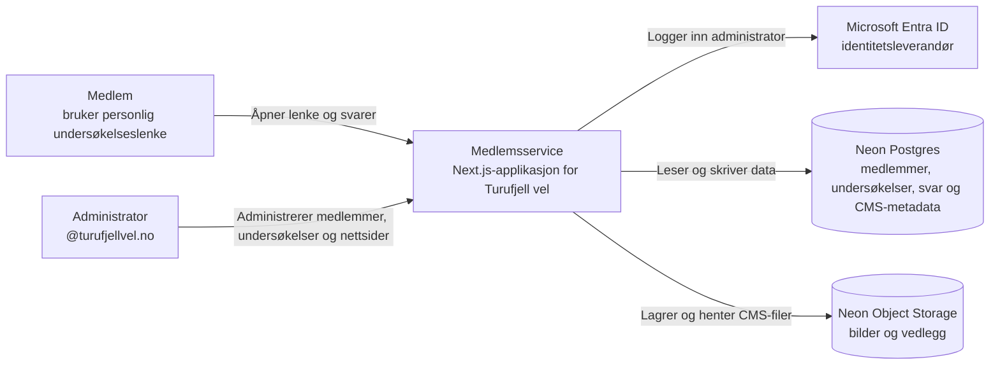
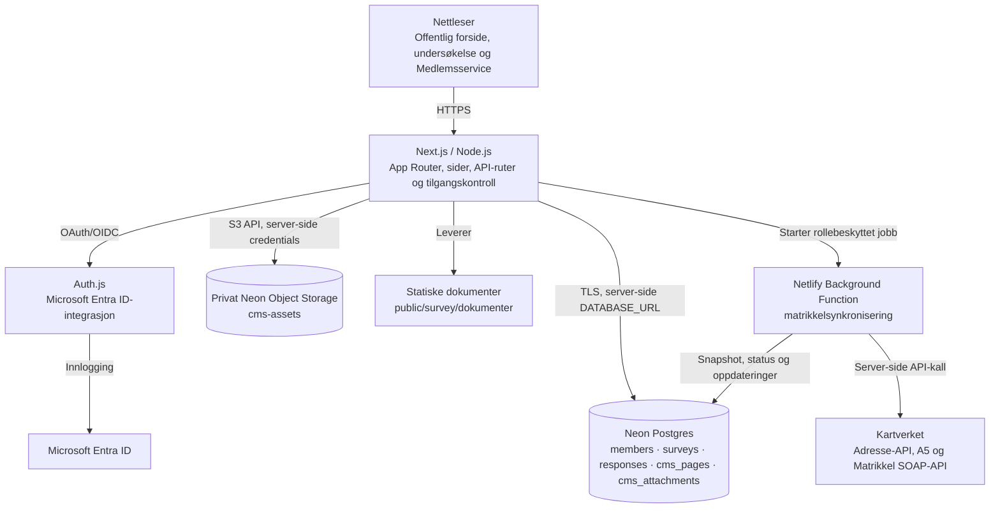
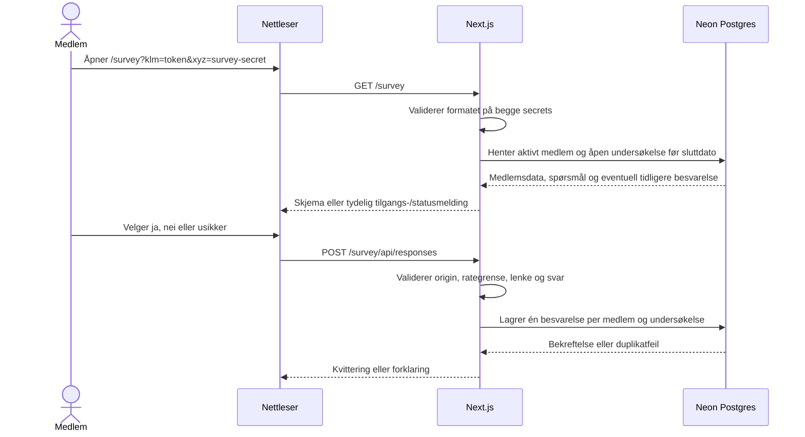
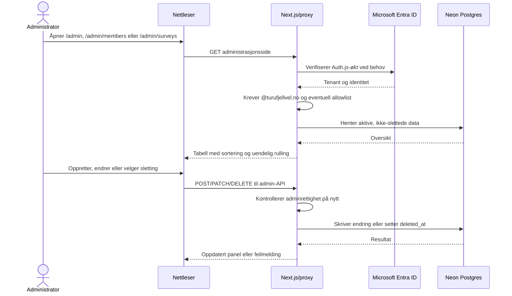
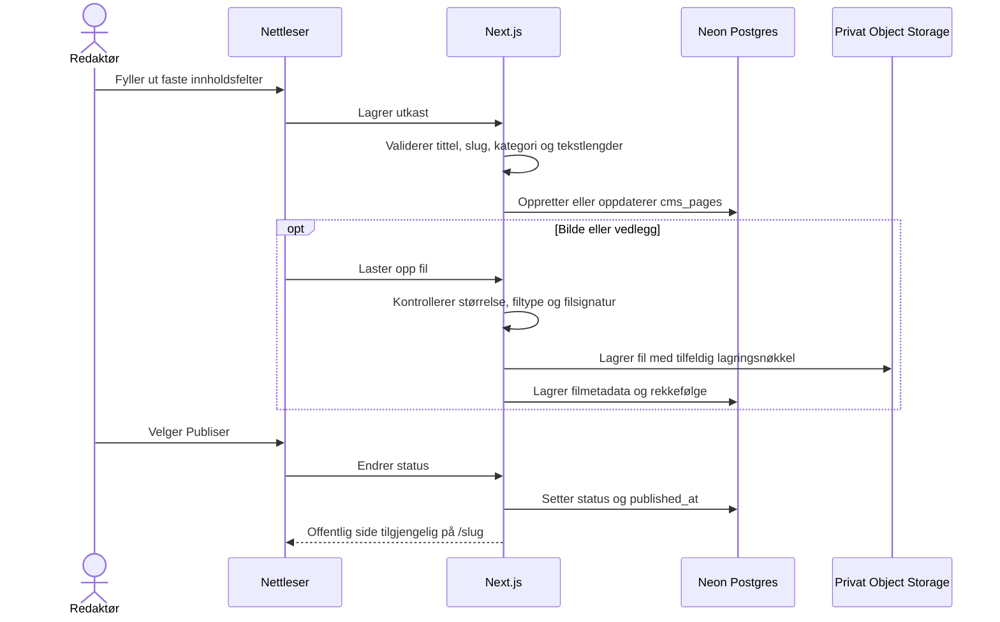

# Medlemsservice · Turufjell vel

En modulbasert medlemsservice bygget med Next.js, React, Node, Neon Postgres og
Neon Object Storage. Den har medlemsregister, undersøkelser og et strukturert
CMS for informasjonssider.

## Krav

- Node.js 22.19 eller nyere
- npm
- En Neon-konto og database

## Lokal oppstart

```bash
npm install
cp .env.example .env.local
npm run dev
```

Åpne deretter `http://localhost:3000`.

`npm run dev`, databaseoppsett og medlemsimport bruker systemets sertifikatlager via `--use-system-ca`.
Dette gjør at Node også stoler på sertifikatutstedere installert i operativsystemet,
for eksempel i nettverk med HTTPS-inspeksjon. Ved `UNABLE_TO_GET_ISSUER_CERT_LOCALLY`,
kontroller Node-versjonen og start serveren på nytt med `npm run dev`.
Sertifikatkontrollen skal ikke deaktiveres.

## Sider og tilgang

- `/` er en offentlig forside med logo, hovedinnhold og bunnfelt.
- Hamburgermenyen åpner Microsoft 365-innlogging via `/admin/login`.
- `/admin` er startsiden for Medlemsservice og viser tilgjengelige moduler.
- `/admin/members` er modulen Medlemsregister.
- `/admin/surveys` er modulen Undersøkelser.
- `/admin/web` er CMS-et for nettsider, hovedbilder og nedlastbare vedlegg.
- `/<slug>` viser en publisert informasjonsside. Utkast kan bare forhåndsvises
  fra administrasjonen.
- De seks sist publiserte informasjonssidene vises automatisk på `/`.
- Undersøkelsen ligger på `/survey?klm=<ID>&xyz=<undersøkelses-ID>`.
- Svar sendes til `/survey/api/responses`, og dokumenter ligger under `/survey/dokumenter/`.
- Andre sider og API-er krever autorisert innlogging som standard, også nye ruter.
  Innloggingsendepunkter og nødvendige statiske ressurser er offentlige.
- Gamle medlemslenker til `/?member=...` må oppdateres til `/survey?klm=...&xyz=...`.

## Arkitektur

Skissene følger nivåene i [C4-modellen](https://c4model.com/): først systemets
kontekst, deretter containere (kjørbare eller lagrende deler). Mermaid-diagrammene
renderes direkte i GitHub og de fleste Markdown-visere.

### Systemkontekst



### Containere



`DATABASE_URL` brukes bare på serveren. Nettleseren mottar aldri database-
eller Entra-hemmeligheter. `proxy.js` stanser ikke-offentlige ruter før de når
sider eller API-ruter, og datafunksjonene kontrollerer administratortilgang en
gang til.

### Dataansvar

| Del | Ansvar |
| --- | --- |
| `app/survey/page.js` og `lib/membership.js` | Validerer den personlige lenken og henter kun medlemmet og undersøkelsen lenken gjelder. |
| `app/survey/api/responses/route.js` | Validerer svar, lenke, origin og rategrense før svaret lagres. |
| `app/admin/*` og `app/api/admin/*` | Viser og endrer medlemmer/undersøkelser etter Microsoft-innlogging. |
| `app/admin/web/*` og `app/api/admin/cms/*` | Administrerer strukturert sideinnhold og filmetadata. Alle endringer krever adminøkt. |
| `app/[slug]/page.js` og `components/CmsPageView.js` | Viser kun publiserte sider med systemstyrt typografi og avsnitt. |
| `app/api/cms/files/*` og `lib/cms-storage.js` | Leverer filer fra en privat bøtte etter kontroll av publiseringsstatus eller adminøkt. |
| `lib/admin-*.js` | Felles serverlogikk for sortering, opprettelse, oppdatering og myk sletting. |
| `lib/matrikkel-client.js` | Server-side klient for Adresse-API, A5-avvik og Matrikkelens SOAP-tjenester. |
| `lib/matrikkel-sync.js` | Oppretter sikkerhetskopi, behandler medlemmer og lagrer fremdrift og avvik. |
| `netlify/functions/matrikkel-sync-background.mjs` | Kjører lange synkroniseringer uten å holde nettleserforespørselen åpen. |
| Neon Postgres | Holder medlemsdata, spørsmålsoppsett, besvarelser, sideinnhold og filmetadata. |
| Neon Object Storage | Holder binære bilder og vedlegg i den private bøtten `cms-assets`. |

## Flytdiagrammer

### Medlemslenke og innsending av svar



### Administrasjon av medlemmer og undersøkelser



Sletting er alltid myk: medlemmer får `deleted_at` og tilbakekalt medlemslenke,
mens undersøkelser får `deleted_at` og lukkes. Vanlige oppslag filtrerer bort
slike rader; historiske svar beholdes.

### Opprettelse og publisering av nettside



Redaktøren kan bare beskrive innholdet. Datamodellen har ingen HTML, Markdown,
fontvalg, farger eller egendefinert styling. React rendrer teksten som ren tekst,
og frontend bestemmer automatisk avsnitt, typografi, avstander og responsiv layout.

## Lokal testing uten database

Aktiver mock-modus ved å sette `MOCK_DATA=true` i `.env.local`.
Den lokale installasjonen bruker nå Neon med `MOCK_DATA=false`.
Start eller start utviklingsserveren på nytt med `npm run dev`.
Ingen database brukes til medlemsoppslag eller innsendinger i denne modusen.
Alle medlemsopplysningene er fiktive. Modusen er deaktivert i produksjon
(`npm run build` / `npm run start` bruker den ordinære databaseløsningen).

Testlenker:

- [Gyldig medlem, ikke svart](http://localhost:3000/survey?klm=11111111111111111111111111111111&xyz=616fd7e9e244b6f4947eb1822dbd01ad)
- [Har allerede svart](http://localhost:3000/survey?klm=22222222222222222222222222222222&xyz=616fd7e9e244b6f4947eb1822dbd01ad)
- [Medlem med manglende valgfrie opplysninger](http://localhost:3000/survey?klm=33333333333333333333333333333333&xyz=616fd7e9e244b6f4947eb1822dbd01ad)
- [Ukjent medlem](http://localhost:3000/survey?klm=ffffffffffffffffffffffffffffffff&xyz=616fd7e9e244b6f4947eb1822dbd01ad)
- [Feil ID-format](http://localhost:3000/survey?klm=feil&xyz=616fd7e9e244b6f4947eb1822dbd01ad)
- [Manglende ID](http://localhost:3000/survey)
- [Ugyldig undersøkelse](http://localhost:3000/survey?klm=11111111111111111111111111111111&xyz=ukjent)
- [Simulert databasefeil](http://localhost:3000/survey?klm=dddddddddddddddddddddddddddddddd&xyz=616fd7e9e244b6f4947eb1822dbd01ad)

Testsvar lagres som lokale JSON-filer i `.mock-data/` (ignorert av Git),
og beholdes ved omstart. Etter innsending viser samme lenke at tomten har svart.
Slett `.mock-data/` for å nullstille innsendte testsvar. Medlem 2 vil alltid
være forhåndsregistrert som besvart. Mock-feltene er konfigurert i
`data/mock-members.js`. Sett `MOCK_DATA=false` og start serveren på nytt når
Neon-databasen er klar. Det skjer ingen automatisk overgang til mock ved databasefeil.

## Neon CLI og prosjektoppsett

Neon CLI, prosjektets Neon-skills og MCP-konfigurasjon for Codex er installert.
MCP bruker OAuth og er avgrenset til `ancient-wildflower-97748936`.
CLI-innlogging og MCP-innlogging fullføres separat i nettleseren.

Konfigurasjonen ligger i `neon.mjs` (JavaScript), med:

```js
import { defineConfig } from "@neon/config/v1";

export default defineConfig({
  preview: {
    buckets: {
      "cms-assets": {},
    },
  },
});
```

Prosjektet er koblet til `production`. Ved oppsett på en ny maskin:

```bash
neon login
neon link --project-id ancient-wildflower-97748936 --branch production -y
neon config plan
neon deploy
```

Neon henter tilkoblings- og lagringsvariabler til en lokal miljøfil ved
tilkobling/deploy.
Sørg for at appens `DATABASE_URL` i `.env.local` er den nye verdien; `.env.local`
har prioritet dersom Neon skriver til `.env`. Ikke sjekk inn disse filene.
`neon deploy` anvender Neon-konfigurasjonen. Det publiserer ikke Next.js-appen
og kjører ikke `database/schema.sql`; databaseoppsettet nedenfor er et eget steg.

`cms-assets` er privat. Følgende servervariabler opprettes/hentes av Neon og må
også legges inn i Netlify: `AWS_ACCESS_KEY_ID`, `AWS_SECRET_ACCESS_KEY`,
`AWS_ENDPOINT_URL_S3` og `AWS_REGION`. Ingen av dem skal ha `NEXT_PUBLIC_`-prefiks.
Test helst `neon deploy` på en egen Neon-gren før samme konfigurasjon anvendes på
produksjonsgrenen.

Skjema og CSV-medlemmer er importert til production. Lokal mock-modus er slått av.

## Database

1. Opprett et prosjekt i Neon.
2. Åpne SQL Editor.
3. Legg både en pooled `DATABASE_URL` og direkte `DATABASE_URL_UNPOOLED` i `.env.local`.
4. Trykk `Connect` i Neon og kopier connection string.
5. Legg den i `.env.local`:

```env
DATABASE_URL=postgresql://...-pooler...
DATABASE_URL_UNPOOLED=postgresql://...
```

6. Kjør `npm run db:setup`. Skriptet krever den direkte URL-en, slik at
   migrering aldri går via PgBouncer.

## Strukturert CMS

CMS-et ligger på `/admin/web`. Oversikten har tittelsøk og viser tittel,
kategori, status, endringsdato, publiseringsdato og handlinger. Redigering skjer
i et panel fra høyre. En side består av:

- obligatorisk tittel og automatisk foreslått URL-slug
- kategori, valgfri ingress og valgfri hovedtekst
- valgfritt hovedbilde med alt-tekst og bildetekst
- inntil 20 vedlegg med visningsnavn og redigerbar rekkefølge
- status `Utkast` eller `Publisert`, samt opprettet-, endret- og publisertdato

Tekst lagres uten HTML eller Markdown. Tomme linjer og linjeskift gjøres til
avsnitt i den offentlige visningen. Hovedbilder støtter JPG, PNG og WebP opp til
10 MB. Vedlegg støtter PDF, DOC/DOCX, XLS/XLSX, PPT/PPTX, ZIP, JPG, PNG, WebP og
GIF opp til 20 MB per fil. Filinnhold kontrolleres mot filendelsen før opplasting.

Publiserte sider vises på `/<slug>` og på forsiden. Forhåndsvisning av utkast
krever adminøkt. Sider og filmetadata mykslettes med `deleted_at`; vanlige
spørringer henter dem aldri. Binærfilen beholdes i lagringsbøtten når redaktøren
sletter den, slik at slettingen er reverserbar på datanivå.

## Dokumenter

Legg PDF-er eller andre filer i:

```text
public/survey/dokumenter/
```

Registrer dem deretter i `data/survey.js` i arrayet `surveyDocuments`.

Eksempel:

```js
export const surveyDocuments = [
  {
    title: "Informasjon om Kristnatten",
    description: "Relevant bakgrunnsdokument før du svarer.",
    href: "/survey/dokumenter/kristnatten.pdf",
    meta: "PDF",
  },
];
```

## GitHub

Prosjektet bruker `main` som produksjonsgren. Alle pushes og pull requests
kontrolleres av GitHub Actions-konfigurasjonen i `.github/workflows/ci.yml`:

```bash
npm ci
npm run check
```

`npm run check` kjører ESLint, alle Node-testene og et komplett Next.js-
produksjonsbygg. Lokale miljøfiler, Neon-koblingen og Netlifys lokale
cachemappe er utelatt fra Git gjennom `.gitignore`.

## Produksjonssetting: Netlify + Neon + Microsoft Entra ID

`netlify.toml` inneholder byggkommando, publiseringsmappe, Node-versjon og
funksjonsmappe. Netlify håndterer Next.js App Router gjennom sin Next.js-adapter,
mens den lange matrikkelsynkroniseringen kjøres som en Netlify Background
Function. Se også [Netlifys Next.js-veiledning](https://docs.netlify.com/build/frameworks/framework-setup-guides/nextjs/overview/)
og [veiledningen for Background Functions](https://docs.netlify.com/build/functions/background-functions/).

Følg punktene i denne rekkefølgen ved første produksjonssetting. Bruk en konto
med tilgang til GitHub-repositoriet, Netlify-teamet, Neon-prosjektet og
appregistreringen i Microsoft Entra ID.

### 1. Kontroller kode og GitHub

1. Kontroller at siste commit ligger på `main` i `ibjohansen/tfv-poll`.
2. Åpne fanen **Actions** i GitHub og kontroller at arbeidsflyten
   **Code quality** er grønn for committen som skal publiseres.
3. Kjør den samme kontrollen lokalt dersom det er gjort endringer etter siste
   push:

```bash
npm ci
npm run check
git status --short
```

`git status --short` skal ikke vise ukjente endringer før produksjonssetting.

### 2. Kontroller Neon og databaseskjemaet

1. Kontroller at Neon CLI peker på prosjektets produksjonsgren:

```bash
neon status
neon config plan
```

2. Dersom planen viser at den private bøtten `cms-assets` mangler, kjør:

```bash
neon deploy
```

3. Kontroller at `.env.local` inneholder både pooled `DATABASE_URL` og direkte
   `DATABASE_URL_UNPOOLED` for den samme produksjonsgrenen. Ikke skriv ut eller
   lim forbindelsesstrengene inn i logger eller dokumentasjon.
4. Kjør databaseskjemaet med den direkte forbindelsen når `database/schema.sql`
   er endret:

```bash
npm run db:setup
```

Kommandoen er idempotent. Den kjørende Netlify-applikasjonen skal bruke pooled
`DATABASE_URL`; migrering og import skal bruke den direkte forbindelsen. Dette
følger [Neons anbefaling for pooling og migrering](https://neon.com/docs/connect/connection-pooling).

### 3. Opprett og koble Netlify-prosjektet

1. Logg inn på Netlify og velg **Add new project → Import an existing project**.
2. Velg **GitHub**, godkjenn nødvendig repository-tilgang og velg
   `ibjohansen/tfv-poll`.
3. Bruk `main` som produksjonsgren.
4. Kontroller innstillingene som leses fra `netlify.toml`:

| Innstilling | Verdi |
| --- | --- |
| Base directory | tom / repositoryroten |
| Build command | `npm run build` |
| Publish directory | `.next` |
| Functions directory | `netlify/functions` |
| Node.js | `22` |

5. Opprett prosjektet. Netlify tildeler nå en adresse som
   `https://<prosjektnavn>.netlify.app`.
6. Hvis et eget domene skal brukes med en gang, legg det til under
   **Domain management → Production domains** før autentisering konfigureres.
7. Bestem én kanonisk produksjonsadresse. Bruk adressen uten avsluttende `/` i
   både `AUTH_URL` og Entra-oppsettet.

Netlify beskriver den samme Git-flyten i
[Import an existing project](https://docs.netlify.com/manage/projects/add-new-project/#bring-existing-code-to-netlify).

### 4. Legg inn miljøvariabler i Netlify

Åpne **Project configuration → Environment variables** og legg inn variablene
enkeltvis. Velg produksjonskonteksten og scopes som gjør dem tilgjengelige for
både build og Functions.

Ikke bruk `netlify env:import .env.local`. Den lokale filen inneholder verdier
som ikke skal inn i produksjonsmiljøet, blant annet direkte databaseforbindelse,
lokal `AUTH_URL` og eventuell mock-konfigurasjon. Netlify leser heller ikke den
lokale `.env`-filen automatisk under skybygget; se
[Netlify environment variables](https://docs.netlify.com/build/configure-builds/environment-variables/).

#### Påkrevd for database og CMS

| Variabel | Produksjonsverdi |
| --- | --- |
| `DATABASE_URL` | Pooled Neon-forbindelse for produksjonsgrenen |
| `AWS_ACCESS_KEY_ID` | Nøkkelen utstedt for Neon Object Storage |
| `AWS_SECRET_ACCESS_KEY` | Hemmeligheten utstedt for Neon Object Storage |
| `AWS_ENDPOINT_URL_S3` | S3-endepunktet fra Neon |
| `AWS_REGION` | Regionen til Neon-prosjektet, for eksempel `eu-central-1` |

#### Påkrevd for Microsoft-innlogging

| Variabel | Produksjonsverdi |
| --- | --- |
| `AUTH_SECRET` | Unik produksjonshemmelighet på minst 32 bytes |
| `AUTH_MICROSOFT_ENTRA_ID_TENANT_ID` | Directory tenant ID |
| `AUTH_MICROSOFT_ENTRA_ID_ID` | Application client ID |
| `AUTH_MICROSOFT_ENTRA_ID_SECRET` | Verdien til client secret, ikke secret-ID-en |
| `AUTH_URL` | Kanonisk HTTPS-adresse uten avsluttende `/` |

Lag en ny `AUTH_SECRET` for produksjon, for eksempel lokalt med:

```bash
openssl rand -base64 32
```

#### Påkrevd for matrikkelsynkronisering

| Variabel | Produksjonsverdi |
| --- | --- |
| `API_BASE_URL` | `https://matrikkel.no/matrikkelapi/wsapi/v1` |
| `API_USR` | Matrikkel-brukernavn |
| `API_PWD` | Matrikkel-passord, skrevet normalt uten `\$`-escaping |
| `MATRIKKEL_SYNC_EMAILS` | Kommaseparert rolle-allowlist, minst `ib@turufjellvel.no` |
| `MATRIKKEL_JOB_SECRET` | En annen unik hemmelighet på minst 32 bytes |

Generer `MATRIKKEL_JOB_SECRET` separat; ikke bruk samme verdi som `AUTH_SECRET`.

#### Valgfritt eller skal utelates

- Utelat `ADMIN_EMAILS` for å tillate alle godkjente kontoer i den konfigurerte
  tenant-en med nøyaktig `@turufjellvel.no`. Sett den bare hvis admin skal
  begrenses ytterligere.
- Utelat `DATABASE_URL_UNPOOLED`; den trengs ikke av applikasjonen i drift.
- Utelat `MOCK_DATA`, `MOCK_DATA_DIR` og `MATRIKKEL_ALLOW_PRODTEST`.
- Ikke opprett `URL`; Netlify setter denne systemvariabelen selv.
- Ingen hemmelig variabel skal ha `NEXT_PUBLIC_`-prefiks.

### 5. Registrer callback-URL i Microsoft Entra ID

1. Åpne [Microsoft Entra admin center](https://entra.microsoft.com/).
2. Gå til **Identity → Applications → App registrations → All applications**.
3. Åpne appregistreringen som har samme **Application (client) ID** som
   `AUTH_MICROSOFT_ENTRA_ID_ID`.
4. Kontroller at **Supported account types** er satt til kontoer kun i Turufjell
   vels egen organisasjon (single tenant).
5. Gå til **Authentication → Platform configurations**.
6. Velg **Add a platform → Web**, eller legg URI-en til under eksisterende
   Web-plattform.
7. Registrer nøyaktig denne adressen:

```text
https://<kanonisk-produksjonsdomene>/api/auth/callback/microsoft-entra-id
```

8. Velg **Configure/Save**. Ikke legg callbacken under plattformtypen SPA, og
   ikke aktiver implicit grant.
9. Kontroller under **Certificates & secrets** at client secret ikke er utløpt,
   og at verdien i Netlify er den faktiske secret-verdien.

Microsoft krever HTTPS for ordinære produksjons-callbacker og at redirect URI
er registrert for riktig plattform. Se
[Microsofts redirect URI-veiledning](https://learn.microsoft.com/en-us/entra/identity-platform/reply-url).

Hvis produksjonsdomenet endres senere, må både `AUTH_URL` i Netlify og redirect
URI i Entra oppdateres. Utløs en ny deploy etter endringen.

### 6. Utløs produksjonsdeploy

1. Gå til **Deploys** i Netlify.
2. Velg **Trigger deploy → Deploy site**. Bruk **Clear cache and deploy site**
   hvis forrige bygg ble kjørt før miljøvariablene ble lagt inn.
3. Kontroller at byggeloggen avsluttes uten feil.
4. Kontroller at Next.js-funksjonene og
   `matrikkel-sync-background` finnes i Netlifys funksjonsoversikt.
5. Kontroller at den publiserte deployen bruker committen som var godkjent i
   GitHub Actions.

Etter at GitHub-repositoriet er koblet til Netlify, utløser senere pushes til
`main` normalt en ny produksjonsdeploy.

### 7. Verifiser produksjonen

Utfør kontrollene i denne rekkefølgen:

- Åpne `/` og kontroller toppbilde, publiserte artikler og artikkelpanelet.
- Åpne `/admin` i et privat vindu og kontroller at du sendes til innlogging.
- Logg inn som `ib@turufjellvel.no` og kontroller modulene Medlemsregister,
  Undersøkelser og Web.
- Åpne en undersøkelse, kontroller kakediagrammene under **Resultater**, og last
  ned en Excel-eksport.
- Opprett et CMS-utkast, last opp et lite testvedlegg, forhåndsvis, publiser og
  kontroller den offentlige visningen. Fjern testinnholdet etterpå.
- Generer eller bruk testlenken for eget medlem med H-nummer 25. Kontroller
  opplysningene uten å sende inn et svar dersom undersøkelsen er reell.
- Kjør bare **Test H-nummer 25** i matrikkelmodulen. Kontroller logg og resultat
  før en full matrikkelkjøring startes.
- Kontroller at `/api/admin/surveys` returnerer `401` uten innlogget sesjon.
- Kontroller Netlify Functions-loggene for feil og verifiser at ingen
  hemmeligheter skrives til logg.

### 8. Tilbakerulling og etterarbeid

- Ved feil i applikasjonen: åpne **Deploys** i Netlify og publiser siste kjente
  fungerende deploy på nytt.
- Ikke reverser databaseskjemaet automatisk. Endringene er additive; undersøk
  dataene og bruk Neon restore/branch ved behov før en korrigerende migrering.
- Behold tidligere Entra redirect URI til den nye innloggingen er verifisert.
- Registrer eier og utløpsdato for Entra client secret, Matrikkel-legitimasjonen
  og interne hemmeligheter, slik at de kan roteres før utløp.
- Oppbevar medlems- og resultat-eksporter sikkert og slett lokale kopier når de
  ikke lenger er nødvendige.

Hemmeligheter skal bare administreres i Neon, Netlify og Microsoft Entra ID,
aldri i GitHub-filer eller dokumentasjon.

## Se svar i Neon

I Neon SQL Editor kan du for eksempel kjøre:

```sql
SELECT *
FROM survey_responses
ORDER BY created_at DESC;
```

En enkel opptelling:

```sql
SELECT answers->>'q1' AS svar, COUNT(*) AS antall
FROM survey_responses
WHERE survey_id = '616fd7e9e244b6f4947eb1822dbd01ad'
GROUP BY answers->>'q1'
ORDER BY antall DESC;
```

## Medlemsregister og personlige lenker

Kjør hele `database/schema.sql` i Neon SQL Editor før den nye versjonen tas i bruk.
Skriptet kan kjøres på en eksisterende database: gamle anonyme svar beholdes med
`NULL` i `member_id` og `survey_id`. Disse teller ikke som medlemsbesvarelser.

Tabellen `members` har et internt løpenummer (`id`) og en tilfeldig offentlig
lenke-ID (`access_token`, 32 heksadesimale tegn). ID-en genereres av databasen
og er ikke avledet fra H-nummer eller andre medlemsopplysninger.

Lenkeformat:

```text
https://deres-domene.no/survey?klm=<access_token>&xyz=616fd7e9e244b6f4947eb1822dbd01ad
```

Startundersøkelsen i `data/survey.js` seedes til `surveys` ved databaseoppsett.
Nye undersøkelser opprettes og redigeres i administrasjonen. Hver får en
obligatorisk sluttdato og er tilgjengelig ut denne datoen i norsk tid, samt en
tilfeldig 32-tegns hex-ID. Etter sluttdatoen viser medlemslenken at undersøkelsen
er avsluttet og API-et avviser nye svar. Svar lagres som et JSON-objekt med spørsmåls-ID-er
og `surveyVersion`; versjonen økes automatisk når spørsmålene endres. Hver
besvarelse beholder også et snapshot av spørsmålstekstene som var aktive ved
innsending. Eldre svar får beste tilgjengelige snapshot ved migreringen, siden
tidligere spørsmålstekster ikke kan rekonstrueres. Tillatte svar er `ja`, `nei`
og `usikker`.

Klikk på en undersøkelse i `/admin/surveys` og velg fanen **Resultater** for å
se svarfordeling per spørsmål som kakediagram, antall og prosent. Dersom
spørsmålene har blitt endret, vises resultatene separat per spørsmålsversjon.
Excel-eksporten inneholder både en aggregert oppsummering og et detaljark med
én rad per spørsmål og besvarelse. Resultater og eksport er tilgjengelige både
mens undersøkelsen er åpen og etter at sluttdatoen er passert.

Manglende, feilformatert eller ukjent medlems-ID, ugyldig undersøkelse og
allerede innsendt svar vises øverst. Ved databasefeil vises en melding om at
registeret er utilgjengelig. Skjemaet er bare tilgjengelig med gyldig lenke.
API-et validerer samme tilgang på nytt. En unik databaseindeks på
`(member_id, survey_id)` hindrer også dobbeltsvar ved samtidige innsendinger.
Endepunktet har i tillegg en enkel per-instans rategrense og origin-kontroll.
Aktiver tilsvarende delt rategrense/WAF-regel for `/survey` og
`/survey/api/responses` i driftsplattformen før produksjonslansering.

Lenken er en personlig tilgangshemmelighet og gir rett til å svare for tomten.
Den viser medlemsopplysningene for den aktuelle tomten, inkludert kontaktinformasjon.
Del den bare med de aktuelle kontaktene. Lenker utløper etter 180 dager og kan
tilbakekalles ved å sette `access_revoked_at` i medlemsregisteret. Svarene er
koblet til tomten og er ikke anonyme. Siden rendres dynamisk, og `no-referrer`
hindrer at medlemslenken sendes som referanse ved navigasjon til andre nettsteder.
Svar og medlemsopplysninger skal behandles som personopplysninger: dokumenter
formål, tilgang og slettefrist før utsending.

### CSV-import

Importen leser semikolonseparert UTF-8 CSV, inkludert BOM og tom rad før overskriftene.
Forhåndsvis først; `--apply` skriver alle godkjente rader i én transaksjon:

```bash
npm run db:setup
npm run members:import -- /sti/2026-aktiv.csv
npm run members:import -- /sti/2026-aktiv.csv --apply
```

Regler:

- Tomt H-nummer utelates. `N/A` beholdes som et midlertidig H-nummer.
- Rader uten `Matrikkel-GNR/BR` eller `Tomt/Adresse` utelates.
- Flere `N/A`-rader får ulike interne ID-er og tilfeldige medlemslenker.
- `Matrikkel-eier` og `Matrikkel-tinglyst dato` bevares som tekst, inkludert ` / `.
  Eiernavn vises på separate linjer i både skjema og admin.
- `Navn` ignoreres helt og er ikke påkrevd i CSV-en. Matrikkel-eier brukes alltid som kontaktnavn.
- `Kommentar` lagres kun som adminfelt og hentes aldri i det offentlige medlemsoppslaget.
- Gjentatt import oppdaterer medlemmer etter en intern `import_key` basert på
  matrikkelnummer og adresse. Interne ID-er og medlemslenker beholdes også når
  `N/A` erstattes med et H-nummer. Dersom matrikkelnummer/adresse endres, må
  eksisterende medlemsidentitet avklares før import; kjente H-numre er unike.
- Dupliserte tomter eller kjente H-numre stopper importen. Ingen eksisterende
  medlemmer slettes fordi de mangler i en senere CSV-fil.

| CSV-kolonne | Databasekolonne |
| --- | --- |
| H-nummer | `h_number` |
| Matrikkel-GNR/BR | `cadastral_number` |
| Tomt/Adresse | `street_address` |
| Matrikkel-eier | `title_holder` |
| Matrikkel-tinglyst dato | `registration_date` (tekst) |
| Matrikkel-eier (også kontaktnavn) | `primary_contact_name` |
| Hoved-epost | `primary_contact_email` |
| Extra-epost | `other_contact_emails` (tekstliste) |
| Kommentar | `admin_comment` (kun admin) |

Importen av `2026-aktiv.csv`: 425 medlemmer, inkludert 14 med `N/A`.
164 rader ble utelatt på grunn av manglende matrikkelnummer eller adresse.
Kilde-CSV og medlemsdata ligger ikke i Git eller `public`.

### Synkronisering med Kartverket

Brukere med matrikkelsynk-rollen får valget **Oppdater matrikkeldata** i
hamburgermenyen. Siden ligger på `/admin/members/matrikkel`. Rollen er adskilt
fra vanlig administratortilgang og konfigureres som en kommaseparert allowlist:

```env
MATRIKKEL_SYNC_EMAILS=ib@turufjellvel.no
```

Variabelen må settes eksplisitt. Dersom den mangler eller er tom, har ingen
brukere tilgang til matrikkelsynkronisering.

Kartverkets produksjonslegitimasjon skal bare ligge i `.env.local` lokalt og i
Netlifys server-side miljøvariabler i produksjon:

```env
API_BASE_URL=https://matrikkel.no/matrikkelapi/wsapi/v1
API_USR=<brukernavn>
API_PWD=<passord>
MATRIKKEL_JOB_SECRET=<tilfeldig hemmelighet på minst 32 bytes>
```

I lokal `.env.local` må eventuelle `$`-tegn i `API_PWD` escapes som `\$`.
Next.js ekspanderer ellers teksten etter dollartegnet som en miljøvariabel og
sender et endret passord. I Netlifys miljøvariabelgrensesnitt legges passordet
inn normalt, uten denne escapingen.

Ingen av variablene skal ha `NEXT_PUBLIC_`-prefiks. `MATRIKKEL_JOB_SECRET`
brukes bare til å autentisere den interne bakgrunnsjobben. Prodtest avvises som
standard; ved en bevisst lokal test kan `MATRIKKEL_ALLOW_PRODTEST=true` settes.

Oppslaget bruker `street_address` som eneste søkenøkkel og kan bare skrive:

| Kartverket/verdi | Medlemsfelt |
| --- | --- |
| Gårds- og bruksnummer | `cadastral_number` |
| Aktive tinglyste eiere | `title_holder` |
| Eierforholdets `datoFra` | `registration_date` |

Før hver kjøring kopieres disse tre feltene for alle aktive medlemmer til
`matrikkel_sync_backups` i samme transaksjon som jobbregistreringen. Dette er et
komplett tilbakerullingsgrunnlag for synkroniseringens endringer, men ikke en
ekstern katastrofesikker `pg_dump`. En full dump må lagres kryptert utenfor den
samme databasen og krever at et eget lagringsmål og en slettefrist velges.

Eksakte treff, inkludert entydige A5-avvik, oppdateres automatisk. Fuzzy-treff,
tvetydige treff og eiendommer uten aktiv tinglyst eier endrer ikke medlemmet.
De vises som avvik og må eventuelt godkjennes manuelt. Ved nettverks- eller
API-feil beholdes alle eksisterende medlemsverdier. Rå SOAP-responser,
fødselsnummer og interne person-ID-er lagres ikke.

Bruk **Test H-nummer 25** før første fullstendige kjøring. Testen bruker samme
serverlogikk, sikkerhetskopi og avviksbehandling, men begrenser snapshot og
oppslag til dette ene medlemmet.

`registration_date` inneholder Matrikkelens `datoFra` for det aktive tinglyste
eierforholdet. Det er ikke nødvendigvis kontrakts-, overtakelses- eller faktisk
tinglysningsdato.

## Medlemsservice og Microsoft 365

Åpne `/admin` for startsiden i Medlemsservice, `/admin/members` for medlemmer,
`/admin/surveys` for undersøkelser eller `/admin/web` for nettsider. Publiserte
CMS-sider vises automatisk på den offentlige forsiden og på sin egen slug.
Oversiktene kan sorteres på kolonneoverskriftene. Medlemslisten har søk og
uendelig rulling; klikk på en rad for å åpne redigeringspanelet fra høyre.
Medlemmer og undersøkelser kan opprettes, redigeres og mykslettes via en egen
bekreftelsesdialog. Både siden og datatilgangen krever en autorisert økt.
Det finnes ingen mock-innlogging eller åpen admin-API. Mock-modus påvirker
bare datakilden, og krever også Microsoft-innlogging.

Innlogging bruker Auth.js (`next-auth`) og Microsoft Entra ID. Registrer en
**single-tenant** web-app i organisasjonens Microsoft Entra ID:

1. Åpne Entra ID → App registrations → New registration, og velg kun kontoer
   i egen organisasjon.
2. Legg til Web redirect URI for lokal utvikling:
   `http://localhost:3000/api/auth/callback/microsoft-entra-id`.
   Legg også til tilsvarende URI med det faktiske HTTPS-produksjonsdomenet.
3. Opprett en client secret under Certificates & secrets. Kopier **verdien**,
   ikke secret-ID-en, direkte til serverens miljøvariabler.
4. Sett variablene nedenfor i `.env.local` og tilsvarende i Netlify ved deploy:

```env
AUTH_SECRET=<tilfeldig hemmelighet, minst 32 bytes>
AUTH_MICROSOFT_ENTRA_ID_TENANT_ID=<Directory tenant ID>
AUTH_MICROSOFT_ENTRA_ID_ID=<Application client ID>
AUTH_MICROSOFT_ENTRA_ID_SECRET=<client secret-verdi>
AUTH_URL=http://localhost:3000
ADMIN_EMAILS=
```

`AUTH_SECRET` er generert lokalt. De tre Microsoft-verdiene må fortsatt fylles
inn av en Microsoft 365-administrator. Ingen av variablene skal ha `NEXT_PUBLIC_`
prefiks. `AUTH_URL` skal være det faktiske HTTPS-domenet i produksjon.

Tilgang krever både riktig tenant og e-post på nøyaktig `@turufjellvel.no`.
Alle slike kontoer har tilgang som standard. Sett `ADMIN_EMAILS` til en
kommaseparert liste for å begrense til bestemte personer. Økter varer maksimalt
åtte timer. Utlogging og endring i tillatt e-postliste håndheves på serveren.
Innlogging er stengt når Microsoft-konfigurasjonen mangler.

### Kontroller

```bash
npm run check
```
